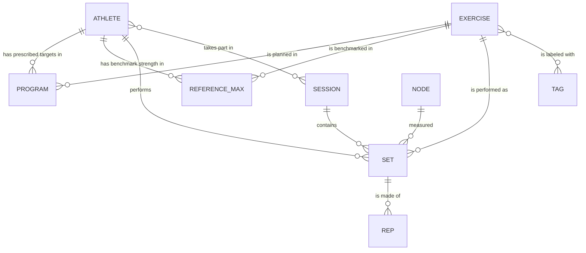

# Edge Athlete — The Database in Plain English

**What this is.** A friendly tour of every table in the Edge Athlete database and how
they fit together — written so you don't need to be an engineer to follow it. If you've
ever wondered "where does the app keep the athletes?" or "what actually happens when a
set finishes?", this is the map.

**The one sentence version.** Edge Athlete watches athletes lift a barbell, measures how
fast the bar moves, and saves every rep so coaches can see who's training well and who's
fatiguing. The database is where all of that is remembered.

> **How to read this doc.** A "table" is just a list — think of a spreadsheet with one
> tab per kind of thing (one tab for athletes, one for sets, and so on). Each row is one
> item; each column is one detail about it. When one table "points to" another, it just
> means a row remembers which row it belongs to — like a set remembering which athlete
> did it. That's all you need to know to follow everything below.

---

## The 30-second big picture

There are three worlds in this system, and the tables split neatly along them:

1. **The equipment on the gym floor** — the sensors on the bars and the tablet screens at
   each rack.
2. **The people and the plan** — the athletes, the list of exercises, and each athlete's
   prescribed targets and benchmark strength.
3. **The training that actually happened** — the sessions, the sets performed, and every
   individual rep.

Everything connects back to two anchors: an **athlete** (who) and an **exercise** (what
movement).

---

## A picture of how it all connects

If the diagram above doesn't render for you, the plain-English version is: **an athlete**
has a plan and benchmarks and performs sets; **an exercise** ties the plan, the
benchmarks, and the sets together; a **session** is a container of sets; a **set** is
made of individual **reps**; and a **node** (sensor) is what measured the set. The
**tablet screens** stand slightly apart — more on that below.

---

## World 1 — The equipment on the gym floor

### `Node` — the sensor on the barbell
The little device (an ESP32 with a motion sensor) clamped to a bar. It's what actually
measures how fast the bar moves. Each node has its own permanent name (`node_id`), and a
coach assigns it to a physical rack by setting its `rack_number`. It also reports its own
health every few seconds — battery level, signal strength, when it was last heard from.

*Think of it as:* the fitness-tracker on the bar.

### `RackScreen` — the tablet standing at a rack
The touchscreen tablet at each rack that shows the live workout. Like the node, it has its
own permanent id (`device_id`, created by the browser the first time it's set up) and a
`rack_number` a coach assigns.

> **The single most important "gotcha" in the whole system:** the sensor (`Node`) and the
> tablet (`RackScreen`) are **two completely separate things**. They are *not* wired
> together in the database. The only thing that connects them is that a coach put them at
> the **same rack number**. That's it. So "Rack 3" is really "whatever sensor a coach
> called Rack 3" plus "whatever tablet a coach called Rack 3" — assigned independently.

---

## World 2 — The people and the plan

### `Athlete` — a lifter
One person who trains. Holds their name, some optional notes, and optionally an NFC tag id
(for a future "tap your wristband to sign in" feature). Almost everything else in the
database eventually points back to an athlete.

*Think of it as:* the roster entry for one person.

### `Exercise` — the official list of movements
The master catalog of movements — "Back Squat," "Bench Press," and so on. This exists so
that everywhere in the system a movement means *exactly one thing*. Without it, one coach
typing "Back Squat" and another typing "back squat" would quietly create two different
exercises and split an athlete's history in half. Every plan, benchmark, and set points at
a catalog entry here instead of spelling out the name themselves.

*Think of it as:* the gym's official menu of movements — everyone orders from the same menu.

### `Tag` — labels for grouping movements
Simple labels a coach can hang on exercises — like "lower body" or "push" — so movements
can be filtered or grouped later. An exercise can wear several tags, and a tag can be on
several exercises.

*Think of it as:* sticky-note labels on the menu items.

### `Program` — an athlete's prescribed targets
For one athlete and one exercise, this is the plan: how many sets and reps to do, the goal
weight, and the **velocity zone** — the range of bar speeds that counts as "on target." A
set an athlete performs is judged against their program. This is where the green / yellow /
red colors on the live screen ultimately come from.

*Think of it as:* the coach's written prescription — "Jordan: Back Squat, 5×3 at 225 lbs,
keep the bar moving at 0.75–0.90 m/s."

### `AthleteReferenceMax` — an athlete's *current* benchmark strength
For one athlete and one exercise, the anchor number the plan is built around — roughly
"how strong they are right now." Two things make this table unusual and worth understanding:

- **It is *not* a lifetime personal best.** It's what the athlete can do *now*, so it can
  go **down** as well as up. If someone comes back from a rough patch weaker, this number
  should drop, and their prescribed weights drop with it. (Lifetime bests are a different
  idea — the system figures those out separately from the set history.)
- **It only ever adds, never edits.** Every time a new benchmark is recorded, it writes a
  brand-new row rather than changing the old one. The athlete's "current" benchmark is
  simply their **newest** row for that movement. The upside: you get a free history of how
  their strength changed over time, and nothing is ever lost.

A benchmark can be a number a coach typed in, or one the system estimates from the velocity
data later — a `source` field tells them apart.

*Think of it as:* a dated logbook of "here's how strong Jordan is in the squat" entries —
you always trust the most recent page, but every old page is kept.

---

## World 3 — The training that actually happened

### `Session` — one training session
A window of time in the gym — like "Thursday, Lower + Push" — that groups together all the
sets performed during it, across everyone who took part. It keeps the roster of athletes
who participated.

*Think of it as:* one page in the gym's daily log.

### `Set` — one set an athlete performed
The heart of the system. One set is one athlete doing one exercise for a number of reps.
A set row is created the moment the set *starts* (recording who, what exercise, which
session, which sensor, the load, the set number), and then its summary — total reps, average
and peak bar speed — is filled in when the set *finishes*. It can also be flagged as a
"false set" if it was a botched or aborted attempt.

*Think of it as:* one line in a workout log — "Set 3: Back Squat, 225 lbs, 3 reps."

### `Rep` — one individual repetition
The finest level of detail: a single rep within a set, with its exact speed (average and
peak), how long it took, and its green / yellow / red color. These are what the whole
sensor system exists to capture.

> **The second big "gotcha":** rep rows are **only** created all at once, when a set is
> finished — never one at a time as they happen. While the athlete is lifting, reps are
> held safely on the tablet itself, and the whole batch is saved to the database in one go
> when the set ends. This keeps the workout safe even if the gym's WiFi blips mid-set.

*Think of it as:* the play-by-play detail behind each set's summary line.

### `RackCheckIn` — who's at which rack, right now
A little logbook: every time an athlete "checks in" (taps their name, or later scans a
band) at a rack, one row is added — who, which rack, which session, and when. Nobody
ever edits or deletes a row; the **newest** row for an athlete says which rack they're
currently at. So when someone moves to a new rack, a newer row quietly takes over and
they leave the old rack's list. A rack's "hot list" (the athletes it currently owns) and
the room's live "who's lifting / resting / ready" view are both just *questions asked of
this logbook plus the set times* — nothing extra is stored.

*Think of it as:* a sign-in sheet where only the latest signature counts.

---

## How the connections read in plain English

- An **athlete** has many **programs** (one per exercise they're prescribed), many
  **reference maxes** (their benchmark history per exercise), and performs many **sets**.
- An **athlete** and a **session** have a many-to-many relationship: a session has many
  athletes, and an athlete takes part in many sessions over time.
- An **exercise** ties three things together — it appears in **programs** (the plan),
  **reference maxes** (the benchmark), and **sets** (what was actually done) — so an
  athlete's plan, strength, and results for a movement all line up on the same identity.
- An **exercise** and a **tag** are many-to-many: an exercise can have several labels, a
  label can be on several exercises.
- A **session** contains many **sets**; a **set** is made up of many **reps**.
- A **node** (sensor) measured many **sets** — but if a node is ever removed, its sets
  survive and simply forget which sensor took them (the reading still stands).
- A **rack screen** (tablet) connects to nothing directly — it finds its sensor only by
  sharing a rack number, as described in World 1.

---

## Mini-glossary

| Term you'll see | What it means here |
|---|---|
| **Table** | A list of one kind of thing (athletes, sets, …). Like a spreadsheet tab. |
| **Row / record** | One item in that list — one athlete, one set. |
| **Field / column** | One detail about it — a name, a weight, a timestamp. |
| **Points to / belongs to** | A row remembering which other row it's tied to (a set → its athlete). |
| **Many-to-many** | A two-way "many" link (sessions ↔ athletes; exercises ↔ tags). |
| **Velocity** | How fast the bar moved, in meters per second — the core measurement. |
| **Velocity zone** | The bar-speed range that counts as "on target" for a prescribed set. |
| **False set** | A botched or aborted set, recorded as such and counted as zero reps. |
| **Node** | The sensor on the bar. **Rack screen** | The tablet at the rack. (Separate!) |

---

*This describes the current 11 tables (`Node`, `RackScreen`, `Athlete`, `Tag`, `Exercise`,
`Program`, `Session`, `Set`, `AthleteReferenceMax`, `Rep`, `RackCheckIn`). If the data model
changes, the source of truth is `django/event_handler/models.py`; keep this overview in step with it.*
