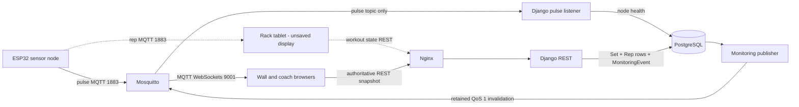

<!--
RUNBOOK.md — the operator's manual for the base station.
This is the "what do I actually type to run this thing" guide for a human sitting
in front of the Pi. It grows across the project: started here in Phase 1 with the
services and start/stop steps, and completed by the Sprint 3 handoff with failure
modes, firmware flashing, and the architecture diagram. If you're on-call, start here.
-->

# Edge Athlete — Base Station RUNBOOK

The whole system runs as one Docker stack on the Raspberry Pi. There is no cloud,
no internet dependency, and no subscription — the Pi broadcasts its own private
WiFi and serves everything itself.

## Services

Every service is defined in `docker-compose.yml` and shares one private Docker
network, so services reach each other by name (e.g. `postgres`, `mosquitto`).

| Service | Port(s) | Purpose |
|---|---|---|
| `postgres` | 5432 (internal) | PostgreSQL database — the source of durable sessions, sets, reps, and room state. |
| `mosquitto` | 1883 (MQTT), 9001 (MQTT-over-WebSockets) | The message broker. Nodes + Django use 1883; browsers connect directly to 9001. |
| `django` | 8000 (internal) | The web/REST server (sync `runserver`). Handles all `/api/` and `/admin/` requests. |
| `mqtt-listener` | — | The ONE MQTT subscriber process. Listens to node pulse topics and updates node health. |
| `monitoring-publisher` | — | Publishes durable room-state invalidations after database commits. |
| `simulator` | — | Optional, profile-gated development traffic; never starts in the normal profile. |
| `react` | 80 (internal) | Builds the front-end to static files and serves them via its own Nginx. |
| `nginx` | 8081 by default (published) | The front door. Routes `/api/`, `/admin/`, `/static/*` to Django and everything else to React. |

> There is exactly ONE MQTT listener service (`mqtt-listener`).

## Start / Stop procedure

From the repo root (where `docker-compose.yml` lives):

```bash
# Start the whole stack and remove services deleted from older revisions
docker compose up --build -d --remove-orphans

# Stop it (containers stop, data volumes persist)
docker compose down

# Stop AND wipe the database volume (destructive — fresh start)
docker compose down -v

# Watch logs for one service
docker compose logs -f django
docker compose logs -f mqtt-listener
```

First boot builds the Django and React images; the Django service runs database
migrations before starting the server. The app is reachable at
`http://<pi-ip>:8081/` (or `http://localhost:8081/` on the dev host).

## Training-day flow

1. **Coach setup:** Sign in at `/coach`. Create ordered workouts and a
   `WorkoutProgram`, assign the complete program to each athlete, and set any
   athlete exercise overrides. Do not assign normal athlete-driven work to racks.
2. **Start Day:** Select the athlete roster and start one day. The start
   transaction activates uniquely registered racks and publishes a
   `session_started` room revision.
3. **Athlete sign-in:** At `/rack`, use manual name selection and explicit
   confirmation. This is the supported identity flow until PN532 hardware,
   wristband payloads, and firmware are verified. A generic
   `rack_screen_conflict` means the rack does not have exactly one registered
   screen; use the authenticated coach room view to inspect registration counts.
4. **Train and progress:** The rack starts the server-derived current set through
   `POST /api/racks/{rack}/sets/` and completes it through
   `POST /api/racks/{rack}/sets/{id}/complete/` with `X-Rack-Device-Id`. A
   qualifying completion advances the expected set, exercise, or workout in the
   same transaction. False or unfinished sets do not advance progress.
5. **Move racks:** Finish the active set, then confirm the athlete at the new
   rack. Progress follows the athlete; an unfinished set blocks movement.
6. **End Day:** Resolve unfinished sets, then use End Day. Django ends the day,
   clears active rack identities, and creates one immutable schema 2 report for
   athlete-driven days.
7. **Download reports:** In the coach report workspace, download the whole-day
   PDF or an athlete-day PDF. JSON report detail remains available if PDF
   rendering fails. All report and PDF routes require an active staff JWT.

## Config files and where they live

| File | What it controls |
|---|---|
| `.env` | Real runtime values (DB login, MQTT host, Django secret). **Gitignored.** |
| `.env.example` | Committed local-development defaults; deployment secrets must be replaced. |
| `/etc/edgeathlete/ap.env` | Root-only Wi-Fi password generated by `setup.sh`. |
| `docker-compose.yml` | Which services run and how they're wired together. |
| `mosquitto/mosquitto.conf` | The broker's two listeners: 1883 (MQTT) + 9001 (WebSockets). |
| `nginx/nginx.conf` | Reverse-proxy routing: `/api/`, `/admin/`, `/static/*` → Django, `/` → React. |
| `django/basestation_config/settings.py` | Django configuration (reads everything from `.env`). |

Retrieve the generated access-point password locally with
`sudo cat /etc/edgeathlete/ap.env`. To rotate it, use
`sudoedit /etc/edgeathlete/ap.env`, set a new 8-63 character `AP_PASSWORD`, and
rerun `sudo ./setup.sh` to atomically rebuild the root-only NetworkManager
profile. Connected devices must then join with the new password.

## Rebuilds and Nginx service discovery

Rebuild changed application images with:

```bash
docker compose up --build -d --remove-orphans
```

`nginx/nginx.conf` uses Docker's `127.0.0.11` resolver and variable upstreams for
`django` and `react`. Nginx refreshes those service addresses every 10 seconds,
so recreating either application container does not leave Nginx pinned to its old
IP. If `nginx/nginx.conf` itself changes, recreate Nginx so it reloads the mounted
configuration:

```bash
docker compose up -d --force-recreate nginx
```

## MQTT test commands

The broker accepts anonymous MQTT only inside the controlled, unique-password Pi
access-point boundary. TLS and broker ACLs remain required before broader network
exposure, so these local checks use no broker credentials.

```bash
# Watch every Edge Athlete topic (run in its own terminal)
mosquitto_sub -h localhost -t 'edgeathlete/#' -v

# Publish a fake pulse and confirm the subscriber above sees it
mosquitto_pub -h localhost -t edgeathlete/node/test/pulse -m '{}'
```

Browser check for the wall and coach MQTT invalidation path on port 9001. In a
browser JS console with an `mqtt.js` client:

```js
const c = mqtt.connect(`ws://${location.hostname}:9001`);
c.on('connect', () => c.subscribe('edgeathlete/node/test/pulse'));
c.on('message', (t, m) => console.log(t, m.toString()));
// then, from a terminal:
//   mosquitto_pub -t edgeathlete/node/test/pulse -m '{}'
// the console should log the message.
```

## Simulated live readings

Use the opt-in simulator when sensor hardware is unavailable. `monitoring` mode
persists generated reps through the atomic completion service, which drives wall,
coach, history, and analytics screens. `rack` mode publishes rep MQTT payloads
without persistence for the current rack's explicitly unsaved display. Both modes
publish node pulses.

```bash
# Start the normal stack plus four simulated racks (capped at 100 set cycles)
docker compose --profile simulation up --build -d

# Watch generated readings and completed sets
docker compose logs -f simulator

# Stop only the simulator; saved simulation history remains available
docker compose --profile simulation stop simulator

# Delete all records owned by reserved simulation identities
docker compose run --rm -e SIMULATOR_ENABLED=True django \
  python manage.py clear_simulation_data --confirm

# Run one fast, repeatable set on one rack, then exit
docker compose run --rm -e SIMULATOR_ENABLED=True django \
  python manage.py simulate_node --mode monitoring --racks 1 --rack 1 --sets 1 \
  --interval 0.25 --rest 0 --seed 42

# Exercise the rack's unsaved MQTT display without pre-saving reps
docker compose run --rm -e SIMULATOR_ENABLED=True django \
  python manage.py simulate_node --mode rack --racks 1 --rack 1 --sets 10
```

Open `http://localhost:8081/rack` before rack-mode simulation. The screen must
first register, receive a rack assignment, and have an eligible roster athlete
sign in through manual confirmation. Django selects the athlete's current
movement from progress. Rack-mode reps are labeled unsaved and do not create
`Set` or `Rep` rows in PostgreSQL.

The default session is named `[SIMULATION] Live training`. Generated records carry
durable simulation ownership fields; prefixes remain human-readable labels only.
The cleanup command deletes only records marked as simulated and refuses to race
a running simulator. The command refuses to run while
a non-simulation session is active. Continuous mode requires a nonzero cadence,
has a maximum of 1,000 cycles, and uses 100 cycles by default. Do not put names or
other personal information in a simulation session label.

## Common failure modes

### Access point unavailable

Confirm the Pi has a Wi-Fi adapter and that the `EdgeAthlete-AP` NetworkManager
profile still exists with the generated password in `/etc/edgeathlete/ap.env`.
If provisioning is incomplete, rerun `sudo ./setup.sh`; then reconnect clients
using the current password. Physical AP behavior still requires deployment testing.

### Broker ports occupied or unreachable

If stack startup reports that 1883 or 9001 is already allocated, stop the older
MQTT project using those ports and start this stack again. If remote clients
cannot connect, confirm `EDGEATHLETE_BIND_ADDRESS` is the Pi AP address rather
than loopback. Use the MQTT checks above and inspect
`docker compose logs -f mqtt-listener` before changing broker configuration.

### System clock is wrong

The offline Pi may have neither NTP nor a hardware RTC. Compare its displayed
date and time with a trusted clock before a session and correct it through the
operating-system time settings. Do not record sets until the clock is correct;
otherwise persisted rep, set, pulse, and monitoring timestamps will be unreliable.

Set `DJANGO_TIME_ZONE` to the site's IANA timezone, such as
`America/Chicago`, before generating or browsing reports. It defaults to `UTC`.
This setting controls each report's `local_date`; stored timestamps remain
timezone-aware and unchanged.

### Set completion failed

Keep the complete set payload intact and retry the same completion request rather
than writing reps individually. Inspect `docker compose logs -f django` for
validation or database errors and `docker compose logs -f monitoring-publisher`
for post-commit broker failures. A broker failure leaves the committed set intact
and the monitoring event pending; a retry response indicating the set is already
complete must be reconciled from REST rather than submitted as a new set.

### Training-day limit reached

One training day can persist at most 100 athletes, 500 sets, and 5,000 reps. A
set or rep overflow returns `session_set_limit` or `session_rep_limit` without a
partial write. Set creation returns `athlete_not_in_session` when the athlete is
outside the submitted Session roster. Set create and complete requests from one
anonymous client share a 120-per-minute throttle and may return HTTP 429 during
a request burst.

Ending a day also caps the compact UTF-8 report snapshot at 4 MiB. A
`report_too_large` response reports only aggregate dimensions and leaves the day
active, rack identity selected, and report absent. Do not edit PostgreSQL rows to
bypass a limit. Correct accidental data or begin a new training day, then retry
through the coach interface.

Coach report details provide daily and athlete-scoped PDF downloads. PDFs are
rendered only from the immutable report snapshot and are capped at 250 pages and
8 MiB. `unsupported_report_schema`, `pdf_too_large`, and `pdf_render_failed`
leave the stored report unchanged; use the JSON report detail if rendering fails.
Both PDF routes share a per-coach limit of 10 requests per minute. Requests over
the limit return HTTP 429 before a report lookup or PDF render.

## Disposable migration rollback check for 0012/0013

Do not run this procedure against the normal `POSTGRES_DB`. Reversing `0013`
deletes `AthleteRackParticipation` timestamps and rack-visit metadata. Reversing
`0012` then deletes whole-program assignment, athlete/day progress, and stable Set
binding metadata. Athletes, Sessions, Sets, Reps, legacy assignments, and
immutable report snapshots remain, but reapplying the migrations cannot recreate
the removed metadata.

The commands below use the fixed database name
`edgeathlete_rollback_0012_0013`. The first command refuses to continue if that
name already exists. The Django assertion verifies every migration command is
connected to that disposable database.

```bash
# Refuse to reuse an existing database, then create the disposable database.
docker compose exec postgres sh -eu -c \
  'test -z "$(psql -U "$POSTGRES_USER" -d postgres -Atc "SELECT datname FROM pg_database WHERE datname = '\''edgeathlete_rollback_0012_0013'\''")"; createdb -U "$POSTGRES_USER" edgeathlete_rollback_0012_0013'

# Verify the target name and build it through 0013.
docker compose run --rm -e POSTGRES_DB=edgeathlete_rollback_0012_0013 django \
  python manage.py shell -c 'from django.db import connection; assert connection.settings_dict["NAME"] == "edgeathlete_rollback_0012_0013"; print(connection.settings_dict["NAME"])'
docker compose run --rm -e POSTGRES_DB=edgeathlete_rollback_0012_0013 django \
  python manage.py migrate event_handler 0013

# Seed metadata that 0012/0013 own, plus one Set whose legacy row must survive.
docker compose run --rm -e POSTGRES_DB=edgeathlete_rollback_0012_0013 django \
  python manage.py shell -c 'from event_handler.models import Athlete, AthleteDayProgress, AthleteRackParticipation, AthleteWorkoutProgramAssignment, Node, Session, Set, Workout, WorkoutExercise, WorkoutProgram, WorkoutProgramItem; a=Athlete.objects.create(name="ROLLBACK_SENTINEL"); w=Workout.objects.create(name="Rollback Workout"); e=WorkoutExercise.objects.create(workout=w, exercise="Rollback Squat", position=1, sets=1, reps=1, default_weight_lbs=0); p=WorkoutProgram.objects.create(name="Rollback Program"); i=WorkoutProgramItem.objects.create(workout_program=p, workout=w, position=1); s=Session.objects.create(label="ROLLBACK_SENTINEL"); s.athletes.add(a); AthleteWorkoutProgramAssignment.objects.create(athlete=a, workout_program=p); progress=AthleteDayProgress.objects.create(session=s, athlete=a, workout_program=p, current_program_item=i, current_workout_exercise=e, expected_set_number=1); AthleteRackParticipation.objects.create(session=s, athlete=a, rack_number=1); n=Node.objects.create(node_id="rollback-sentinel", rack_number=1); Set.objects.create(session=s, athlete=a, node=n, exercise=e.exercise, set_number=1, athlete_day_progress=progress, workout_program_item=i, workout_exercise=e); print("disposable metadata seeded")'

# Exercise the metadata-losing rollback, then reapply it on the disposable DB.
docker compose run --rm -e POSTGRES_DB=edgeathlete_rollback_0012_0013 django \
  python manage.py migrate event_handler 0011
docker compose run --rm -e POSTGRES_DB=edgeathlete_rollback_0012_0013 django \
  python manage.py migrate event_handler 0013

# Confirm legacy rows remain while 0012/0013 metadata and Set bindings are gone.
docker compose run --rm -e POSTGRES_DB=edgeathlete_rollback_0012_0013 django \
  python manage.py shell -c 'from event_handler.models import Athlete, AthleteWorkoutProgramAssignment, AthleteDayProgress, AthleteRackParticipation, Session, Set; assert Athlete.objects.filter(name="ROLLBACK_SENTINEL").exists(); assert Session.objects.filter(label="ROLLBACK_SENTINEL").exists(); retained=Set.objects.get(exercise="Rollback Squat"); assert retained.athlete_day_progress_id is None and retained.workout_program_item_id is None and retained.workout_exercise_id is None; assert not AthleteWorkoutProgramAssignment.objects.exists(); assert not AthleteDayProgress.objects.exists(); assert not AthleteRackParticipation.objects.exists(); print("disposable rollback/reapply verified")'

# Remove only the fixed disposable database.
docker compose exec postgres sh -eu -c \
  'test "$POSTGRES_DB" != "edgeathlete_rollback_0012_0013"; dropdb -U "$POSTGRES_USER" edgeathlete_rollback_0012_0013'
```

For a production rollback, export the `0012`/`0013` metadata or take and verify a
database backup first. Do not treat migration reapplication as data recovery.

## Firmware flashing

Deferred. The exact ESP32 board, toolchain, USB driver, pin mapping, and flashing
procedure have not been verified, so this runbook does not prescribe commands.

## Architecture diagram


