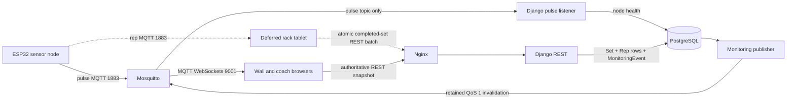

<!--
RUNBOOK.md — the operator's manual for the base station.
This is the "what do I actually type to run this thing" guide for a human sitting
in front of the Pi. It grows across the project: started here in Phase 1 with the
services and start/stop steps, and completed by the Sprint 3 handoff with failure
modes, firmware flashing, and the architecture diagram. If you're on-call, start here.
-->

# Edge Athlete — Base Station RUNBOOK

The whole system runs as one Docker stack on the Raspberry Pi. There is no cloud,
no internet dependency, and no subscription — the Pi broadcasts its own private
WiFi and serves everything itself.

## Services

Every service is defined in `docker-compose.yml` and shares one private Docker
network, so services reach each other by name (e.g. `postgres`, `mosquitto`).

| Service | Port(s) | Purpose |
|---|---|---|
| `postgres` | 5432 (internal) | PostgreSQL database — the source of durable sessions, sets, reps, and room state. |
| `mosquitto` | 1883 (MQTT), 9001 (MQTT-over-WebSockets) | The message broker. Nodes + Django use 1883; browsers connect directly to 9001. |
| `django` | 8000 (internal) | The web/REST server (sync `runserver`). Handles all `/api/` and `/admin/` requests. |
| `mqtt-listener` | — | The ONE MQTT subscriber process. Listens to node pulse topics and updates node health. |
| `monitoring-publisher` | — | Publishes durable room-state invalidations after database commits. |
| `simulator` | — | Optional, profile-gated development traffic; never starts in the normal profile. |
| `react` | 80 (internal) | Builds the front-end to static files and serves them via its own Nginx. |
| `nginx` | 8081 by default (published) | The front door. Routes `/api/`, `/admin/`, `/static/*` to Django and everything else to React. |

> There is exactly ONE MQTT listener service (`mqtt-listener`).

## Start / Stop procedure

From the repo root (where `docker-compose.yml` lives):

```bash
# Start the whole stack and remove services deleted from older revisions
docker compose up --build -d --remove-orphans

# Stop it (containers stop, data volumes persist)
docker compose down

# Stop AND wipe the database volume (destructive — fresh start)
docker compose down -v

# Watch logs for one service
docker compose logs -f django
docker compose logs -f mqtt-listener
```

First boot builds the Django and React images; the Django service runs database
migrations before starting the server. The app is reachable at
`http://<pi-ip>:8081/` (or `http://localhost:8081/` on the dev host).

## Config files and where they live

| File | What it controls |
|---|---|
| `.env` | Real runtime values (DB login, MQTT host, Django secret). **Gitignored.** |
| `.env.example` | Committed local-development defaults; deployment secrets must be replaced. |
| `/etc/edgeathlete/ap.env` | Root-only Wi-Fi password generated by `setup.sh`. |
| `docker-compose.yml` | Which services run and how they're wired together. |
| `mosquitto/mosquitto.conf` | The broker's two listeners: 1883 (MQTT) + 9001 (WebSockets). |
| `nginx/nginx.conf` | Reverse-proxy routing: `/api/`, `/admin/`, `/static/*` → Django, `/` → React. |
| `django/basestation_config/settings.py` | Django configuration (reads everything from `.env`). |

Retrieve the generated access-point password locally with
`sudo cat /etc/edgeathlete/ap.env`. To rotate it, use
`sudoedit /etc/edgeathlete/ap.env`, set a new 8-63 character `AP_PASSWORD`, and
rerun `sudo ./setup.sh` to atomically rebuild the root-only NetworkManager
profile. Connected devices must then join with the new password.

## MQTT test commands

The broker accepts anonymous MQTT only inside the controlled, unique-password Pi
access-point boundary. TLS and broker ACLs remain required before broader network
exposure, so these local checks use no broker credentials.

```bash
# Watch every Edge Athlete topic (run in its own terminal)
mosquitto_sub -h localhost -t 'edgeathlete/#' -v

# Publish a fake pulse and confirm the subscriber above sees it
mosquitto_pub -h localhost -t edgeathlete/node/test/pulse -m '{}'
```

Browser check for the wall and coach MQTT invalidation path on port 9001. In a
browser JS console with an `mqtt.js` client:

```js
const c = mqtt.connect(`ws://${location.hostname}:9001`);
c.on('connect', () => c.subscribe('edgeathlete/node/test/pulse'));
c.on('message', (t, m) => console.log(t, m.toString()));
// then, from a terminal:
//   mosquitto_pub -t edgeathlete/node/test/pulse -m '{}'
// the console should log the message.
```

## Simulated live readings

Use the opt-in simulator when sensor hardware is unavailable. `monitoring` mode
persists generated reps through the same atomic completion service as rack REST
requests, which drives wall, coach, history, and analytics screens. `rack` mode
publishes rep MQTT payloads without persistence, allowing a rack client to own
set boundaries and submit each set exactly once. Both modes publish node pulses.

```bash
# Start the normal stack plus four simulated racks (capped at 100 set cycles)
docker compose --profile simulation up --build -d

# Watch generated readings and completed sets
docker compose logs -f simulator

# Stop only the simulator; saved simulation history remains available
docker compose --profile simulation stop simulator

# Delete all records owned by reserved simulation identities
docker compose run --rm -e SIMULATOR_ENABLED=True django \
  python manage.py clear_simulation_data --confirm

# Run one fast, repeatable set on one rack, then exit
docker compose run --rm -e SIMULATOR_ENABLED=True django \
  python manage.py simulate_node --mode monitoring --racks 1 --rack 1 --sets 1 \
  --interval 0.25 --rest 0 --seed 42

# Exercise a rack client's MQTT and set-completion path without pre-saving reps
docker compose run --rm -e SIMULATOR_ENABLED=True django \
  python manage.py simulate_node --mode rack --racks 1 --rack 1 --sets 10
```

The default session is named `[SIMULATION] Live training`. Generated records carry
durable simulation ownership fields; prefixes remain human-readable labels only.
The cleanup command deletes only records marked as simulated and refuses to race
a running simulator. The command refuses to run while
a non-simulation session is active. Continuous mode requires a nonzero cadence,
has a maximum of 1,000 cycles, and uses 100 cycles by default. Do not put names or
other personal information in a simulation session label.

## Common failure modes

### Access point unavailable

Confirm the Pi has a Wi-Fi adapter and that the `EdgeAthlete-AP` NetworkManager
profile still exists with the generated password in `/etc/edgeathlete/ap.env`.
If provisioning is incomplete, rerun `sudo ./setup.sh`; then reconnect clients
using the current password. Physical AP behavior still requires deployment testing.

### Broker ports occupied or unreachable

If stack startup reports that 1883 or 9001 is already allocated, stop the older
MQTT project using those ports and start this stack again. If remote clients
cannot connect, confirm `EDGEATHLETE_BIND_ADDRESS` is the Pi AP address rather
than loopback. Use the MQTT checks above and inspect
`docker compose logs -f mqtt-listener` before changing broker configuration.

### System clock is wrong

The offline Pi may have neither NTP nor a hardware RTC. Compare its displayed
date and time with a trusted clock before a session and correct it through the
operating-system time settings. Do not record sets until the clock is correct;
otherwise persisted rep, set, pulse, and monitoring timestamps will be unreliable.

### Set completion failed

Keep the complete set payload intact and retry the same completion request rather
than writing reps individually. Inspect `docker compose logs -f django` for
validation or database errors and `docker compose logs -f monitoring-publisher`
for post-commit broker failures. A broker failure leaves the committed set intact
and the monitoring event pending; a retry response indicating the set is already
complete must be reconciled from REST rather than submitted as a new set.

## Firmware flashing

Deferred. The exact ESP32 board, toolchain, USB driver, pin mapping, and flashing
procedure have not been verified, so this runbook does not prescribe commands.

## Architecture diagram


