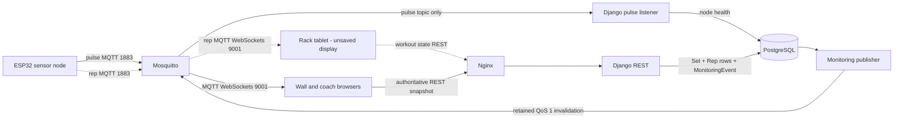

<!--
RUNBOOK.md — the operator's manual for the base station.
This is the "what do I actually type to run this thing" guide for a human sitting
in front of the Pi. It grows across the project: started here in Phase 1 with the
services and start/stop steps, and completed by the Sprint 3 handoff with failure
modes, firmware flashing, and the architecture diagram. If you're on-call, start here.
-->

# Edge Athlete — Base Station RUNBOOK

The whole system runs as one Docker stack on the Raspberry Pi. There is no cloud,
no internet dependency, and no subscription — the Pi broadcasts its own private
WiFi and serves everything itself.

## Services

Every service is defined in `docker-compose.yml` and shares one private Docker
network, so services reach each other by name (e.g. `postgres`, `mosquitto`).

| Service | Port(s) | Purpose |
|---|---|---|
| `postgres` | 5432 (internal) | PostgreSQL database — the source of durable sessions, sets, reps, and room state. |
| `mosquitto` | 1883 (MQTT), 9001 (MQTT-over-WebSockets) | The message broker. Nodes + Django use 1883; browsers connect directly to 9001. |
| `django` | 8000 (internal) | The web/REST server (sync `runserver`). Handles all `/api/` and `/admin/` requests. |
| `mqtt-listener` | — | The ONE MQTT subscriber process. Listens to node pulse topics and updates node health. |
| `monitoring-publisher` | — | Publishes durable room-state invalidations after database commits. |
| `simulator` | — | Optional, profile-gated development traffic; never starts in the normal profile. |
| `react` | 80 (internal) | Builds the front-end to static files and serves them via its own Nginx. |
| `nginx` | 8081 by default (published) | The front door. Routes `/api/`, `/admin/`, `/static/*` to Django and everything else to React. |

> There is exactly ONE MQTT listener service (`mqtt-listener`).

## Start / Stop procedure

From the repo root (where `docker-compose.yml` lives):

```bash
# Start the whole stack and remove services deleted from older revisions
docker compose up --build -d --remove-orphans

# Stop it (containers stop, data volumes persist)
docker compose down

# Stop AND wipe the database volume (destructive — fresh start)
docker compose down -v

# Watch logs for one service
docker compose logs -f django
docker compose logs -f mqtt-listener
```

First boot builds the Django and React images; the Django service runs database
migrations before starting the server. The app is reachable at
`http://<pi-ip>:8081/` (or `http://localhost:8081/` on the dev host).

## Training-day flow

1. **Coach setup:** Sign in at `/coach`. Create ordered workouts and a
   `WorkoutProgram`, then materialize each athlete's schedule. Add recurring
   weekday entries, exact-date plan/rest overrides, and athlete-local workout
   order or targets. An athlete with no active explicit schedule uses the existing
   whole-program assignment as an all-days fallback.
2. **Start Day:** Review the server-local preview and use its one Start Day action.
   Do not rebuild the roster with athlete checkboxes. Django verifies the opaque
   `preview_version`, freezes schema 3 plans and progress, activates uniquely
   registered racks, and publishes a `session_started` room revision.
3. **Athlete sign-in:** At `/rack`, use manual name selection and explicit
   confirmation. This is the supported identity flow until PN532 hardware,
   wristband payloads, and firmware are verified. A generic
   `rack_screen_conflict` means the rack does not have exactly one registered
   screen; use the authenticated coach room view to inspect registration counts.
4. **Train and progress:** Confirmed identity automatically starts the
   server-derived current set for a schema 3 plan. The rack completes it through
   `POST /api/racks/{rack}/sets/{id}/complete/` with `X-Rack-Device-Id`. A
   qualifying completion advances the expected set, exercise, or workout in the
   same transaction. False or unfinished sets do not advance progress. The
   explicit `POST /api/racks/{rack}/sets/` / Start Expected Set path is retained
   only for an active legacy session.
5. **Move racks:** Finish the active set, then confirm the athlete at the new
   rack. Progress follows the athlete; an unfinished set blocks movement.
6. **End Day:** Resolve unfinished sets, then use End Day. Django ends the day,
   clears active rack identities, retains identity-event replay rows, and creates
   one immutable schema 3 report for a frozen scheduled day. Schema 1/2 reports
   remain readable.
7. **Download reports:** In the coach report workspace, download the whole-day
   PDF or an athlete-day PDF. JSON report detail remains available if PDF
   rendering fails. All report and PDF routes require an active staff JWT.

## Config files and where they live

| File | What it controls |
|---|---|
| `.env` | Real runtime values (DB login, MQTT host, Django secret). **Gitignored.** |
| `.env.example` | Committed local-development defaults; deployment secrets must be replaced. |
| `/etc/edgeathlete/ap.env` | Root-only Wi-Fi password generated by `setup.sh`. |
| `docker-compose.yml` | Which services run and how they're wired together. |
| `mosquitto/mosquitto.conf` | The broker's two listeners: 1883 (MQTT) + 9001 (WebSockets). |
| `nginx/nginx.conf` | Reverse-proxy routing: `/api/`, `/admin/`, `/static/*` → Django, `/` → React. |
| `django/basestation_config/settings.py` | Django configuration (reads everything from `.env`). |

Retrieve the generated access-point password locally with
`sudo cat /etc/edgeathlete/ap.env`. To rotate it, use
`sudoedit /etc/edgeathlete/ap.env`, set a new 8-63 character `AP_PASSWORD`, and
rerun `sudo ./setup.sh` to atomically rebuild the root-only NetworkManager
profile. Connected devices must then join with the new password.

## Rebuilds and Nginx service discovery

Rebuild changed application images with:

```bash
docker compose up --build -d --remove-orphans
```

`nginx/nginx.conf` uses Docker's `127.0.0.11` resolver and variable upstreams for
`django` and `react`. Nginx refreshes those service addresses every 10 seconds,
so recreating either application container does not leave Nginx pinned to its old
IP. If `nginx/nginx.conf` itself changes, recreate Nginx so it reloads the mounted
configuration:

```bash
docker compose up -d --force-recreate nginx
```

## MQTT test commands

The broker accepts anonymous MQTT only inside the controlled, unique-password Pi
access-point boundary. TLS and broker ACLs remain required before broader network
exposure, so these local checks use no broker credentials.

```bash
# Watch every Edge Athlete topic (run in its own terminal)
mosquitto_sub -h localhost -t 'edgeathlete/#' -v

# Publish a fake pulse and confirm the subscriber above sees it
mosquitto_pub -h localhost -t edgeathlete/node/test/pulse -m '{}'
```

Browser check for the wall and coach MQTT invalidation path on port 9001. In a
browser JS console with an `mqtt.js` client:

```js
const c = mqtt.connect(`ws://${location.hostname}:9001`);
c.on('connect', () => c.subscribe('edgeathlete/node/test/pulse'));
c.on('message', (t, m) => console.log(t, m.toString()));
// then, from a terminal:
//   mosquitto_pub -t edgeathlete/node/test/pulse -m '{}'
// the console should log the message.
```

## Simulated live readings

Use the opt-in simulator when sensor hardware is unavailable. `monitoring` mode
persists generated reps through the atomic completion service, which drives wall,
coach, history, and analytics screens. `rack` mode publishes rep MQTT payloads
without persistence for the current rack's explicitly unsaved display. Both modes
publish node pulses.

```bash
# Start the normal stack plus four simulated racks (capped at 100 set cycles)
docker compose --profile simulation up --build -d

# Watch generated readings and completed sets
docker compose logs -f simulator

# Stop only the simulator; saved simulation history remains available
docker compose --profile simulation stop simulator

# Delete all records owned by reserved simulation identities
docker compose run --rm -e SIMULATOR_ENABLED=True django \
  python manage.py clear_simulation_data --confirm

# Run one fast, repeatable set on one rack, then exit
docker compose run --rm -e SIMULATOR_ENABLED=True django \
  python manage.py simulate_node --mode monitoring --racks 1 --rack 1 --sets 1 \
  --interval 0.25 --rest 0 --seed 42

# Exercise the rack's unsaved MQTT display without pre-saving reps
docker compose run --rm -e SIMULATOR_ENABLED=True django \
  python manage.py simulate_node --mode rack --racks 1 --rack 1 --sets 10
```

Open `http://localhost:8081/rack` before rack-mode simulation. The screen must
first register, receive a rack assignment, and have an eligible roster athlete
sign in through manual confirmation. Django selects the athlete's current
movement from progress. Rack-mode reps are labeled unsaved and do not create
`Set` or `Rep` rows in PostgreSQL.

The default session is named `[SIMULATION] Live training`. Generated records carry
durable simulation ownership fields; prefixes remain human-readable labels only.
The cleanup command deletes only records marked as simulated and refuses to race
a running simulator. The command refuses to run while
a non-simulation session is active. Continuous mode requires a nonzero cadence,
has a maximum of 1,000 cycles, and uses 100 cycles by default. Do not put names or
other personal information in a simulation session label.

## Demo wristband sign-in

Use this debug-only seed while the physical reader is unavailable. The target must
be an active, non-simulated legacy Session with room for four athletes. A backfilled
`training_date` does not make a legacy Session frozen; frozen day-plan/progress rows
do. The command is idempotent and leaves existing Sets, Reps, progress, rack state,
and identity events unchanged.

```bash
# Add four [DEMO] athletes and their complete fallback program to Session 8.
docker compose run --rm --no-deps django \
  python manage.py seed_demo_athletes --session-id 8

# Remove only ownership-record demo athletes, allowed execution rows, and catalog.
docker compose run --rm --no-deps django \
  python manage.py seed_demo_athletes --session-id 8 --remove --confirm
```

`DemoAthleteSeed(key="wristband-v1")` durably owns the exact Session, catalog, and
four athlete slots. Reruns validate the complete graph and preserve IDs; they never
infer ownership from names, NFC values, or notes. At `/rack`, **Simulate wristband
tap** appears only while the rack is unoccupied and the public rack response marks at
least one athlete `demo_wristband_eligible: true`. Each press randomly chooses one of
those rows and sends the existing `PUT /api/racks/{rack}/athlete/` request with the
current Session and event UUID. Legacy Sessions still require **Start Expected Set**
after sign-in.

End Day returns `409 demo_seed_cleanup_required` while the ownership row exists.
Sign every demo athlete out, then run confirmed cleanup. Cleanup aborts on schedules
or tombstones, day plans, overrides, legacy programs, direct assignments, selected
racks, malformed execution rows, cross-session references, non-demo catalog
references, or missing confirmation. Seeding requires `DEBUG=True`; confirmed,
ownership-validated removal remains available after `DEBUG=False` so operators can
clear the End Day guard safely.

## Common failure modes

### Access point unavailable

Confirm the Pi has a Wi-Fi adapter and that the `EdgeAthlete-AP` NetworkManager
profile still exists with the generated password in `/etc/edgeathlete/ap.env`.
If provisioning is incomplete, rerun `sudo ./setup.sh`; then reconnect clients
using the current password. Physical AP behavior still requires deployment testing.

### Broker ports occupied or unreachable

If stack startup reports that 1883 or 9001 is already allocated, stop the older
MQTT project using those ports and start this stack again. If remote clients
cannot connect, confirm `EDGEATHLETE_BIND_ADDRESS` is the Pi AP address rather
than loopback. Use the MQTT checks above and inspect
`docker compose logs -f mqtt-listener` before changing broker configuration.

### System clock is wrong

The offline Pi may have neither NTP nor a hardware RTC. Compare its displayed
date and time with a trusted clock before a session and correct it through the
operating-system time settings. Do not record sets until the clock is correct;
otherwise persisted rep, set, pulse, and monitoring timestamps will be unreliable.

Set `DJANGO_TIME_ZONE` to the site's IANA timezone, such as
`America/Chicago`, before generating or browsing reports. It defaults to `UTC`.
This setting controls each report's `local_date`; stored timestamps remain
timezone-aware and unchanged.

### Set completion failed

Keep the complete set payload intact and retry the same completion request rather
than writing reps individually. Inspect `docker compose logs -f django` for
validation or database errors and `docker compose logs -f monitoring-publisher`
for post-commit broker failures. A broker failure leaves the committed set intact
and the monitoring event pending; a retry response indicating the set is already
complete must be reconciled from REST rather than submitted as a new set.

### Training-day limit reached

One training day can persist at most 100 athletes, 500 sets, 5,000 reps, and 500
distinct athlete/rack participations. Scheduled Start Day also limits aggregate
prescribed sets to 500 and its frozen zero-result report baseline to 2 MiB. A set,
rep, or participation overflow returns `session_set_limit`, `session_rep_limit`, or
`session_rack_participation_limit` without a partial write. Set creation returns
`athlete_not_in_session` when the athlete is outside the submitted Session roster.
Set create and complete requests from one anonymous client share a 120-per-minute
throttle and may return HTTP 429 during a request burst.

Ending a day also caps the compact UTF-8 report snapshot at 4 MiB. A
`report_too_large` response reports only aggregate dimensions and leaves the day
active, rack identity selected, and report absent. Do not edit PostgreSQL rows to
bypass a limit. Correct accidental data or begin a new training day, then retry
through the coach interface.

Coach report details provide daily and athlete-scoped PDF downloads. PDFs are
rendered only from the immutable report snapshot and are capped at 250 pages and
8 MiB. `unsupported_report_schema`, `pdf_too_large`, and `pdf_render_failed`
leave the stored report unchanged; use the JSON report detail if rendering fails.
Both PDF routes share a per-coach limit of 10 requests per minute. Requests over
the limit return HTTP 429 before a report lookup or PDF render.

## Migration 0014 rollback guard and old-reader warning

Migration `0014_scheduled_athlete_plans` refuses to reverse before changing rows
when an active schema 3 day, active frozen progress, or unfinished frozen Set
exists. End the day and every frozen Set before a rollback; do not bypass this
guard in PostgreSQL.

After a safe reverse, core Athlete, Session, Set, Rep, and DailyReport rows remain,
but schedule/day-plan tables and frozen bindings are removed. Frozen progress that
cannot satisfy the legacy constraints is deleted. Export schedule metadata or
restore a matching application/database backup if it must survive. Reversing an
ended schema 3 day emits a warning because the old application cannot interpret
the preserved schema 3 report or frozen schedule metadata. Do not deploy an old
reader against schema 3 data without an explicit compatibility or restore plan.

Migration `0015` supplies the active tombstone that preserves a schedule's
monotonic version across delete/recreate. Migration `0016` supplies identity-event
replay metadata retained after End Day. Its reverse preflight independently refuses
to change rows while an active schema 3 day, active frozen progress, or unfinished
frozen Set exists. Once safe, reversing `0016` drops only that ledger and preserves
training rows. Clients must issue a new confirmed identity action after reversal.

Migration `0017` adds durable demo-seed ownership and reserved-name uniqueness.
Its reverse preflight refuses to remove ownership metadata while the seed or any
reserved athlete, NFC, workout, or program row remains. Run confirmed demo cleanup
and resolve unbound reserved collisions before reversing to `0016`.

## Disposable migration rollback check for 0012/0013

Do not run this procedure against the normal `POSTGRES_DB`. Reversing `0013`
deletes `AthleteRackParticipation` timestamps and rack-visit metadata. Reversing
`0012` then deletes whole-program assignment, athlete/day progress, and stable Set
binding metadata. Athletes, Sessions, Sets, Reps, legacy assignments, and
immutable report snapshots remain, but reapplying the migrations cannot recreate
the removed metadata.

The commands below use the fixed database name
`edgeathlete_rollback_0012_0013`. The first command refuses to continue if that
name already exists. The Django assertion verifies every migration command is
connected to that disposable database.

```bash
# Refuse to reuse an existing database, then create the disposable database.
docker compose exec postgres sh -eu -c \
  'test -z "$(psql -U "$POSTGRES_USER" -d postgres -Atc "SELECT datname FROM pg_database WHERE datname = '\''edgeathlete_rollback_0012_0013'\''")"; createdb -U "$POSTGRES_USER" edgeathlete_rollback_0012_0013'

# Verify the target name and build it through 0013.
docker compose run --rm -e POSTGRES_DB=edgeathlete_rollback_0012_0013 django \
  python manage.py shell -c 'from django.db import connection; assert connection.settings_dict["NAME"] == "edgeathlete_rollback_0012_0013"; print(connection.settings_dict["NAME"])'
docker compose run --rm -e POSTGRES_DB=edgeathlete_rollback_0012_0013 django \
  python manage.py migrate event_handler 0013

# Seed metadata that 0012/0013 own, plus one Set whose legacy row must survive.
docker compose run --rm -e POSTGRES_DB=edgeathlete_rollback_0012_0013 django \
  python manage.py shell -c 'from event_handler.models import Athlete, AthleteDayProgress, AthleteRackParticipation, AthleteWorkoutProgramAssignment, Node, Session, Set, Workout, WorkoutExercise, WorkoutProgram, WorkoutProgramItem; a=Athlete.objects.create(name="ROLLBACK_SENTINEL"); w=Workout.objects.create(name="Rollback Workout"); e=WorkoutExercise.objects.create(workout=w, exercise="Rollback Squat", position=1, sets=1, reps=1, default_weight_lbs=0); p=WorkoutProgram.objects.create(name="Rollback Program"); i=WorkoutProgramItem.objects.create(workout_program=p, workout=w, position=1); s=Session.objects.create(label="ROLLBACK_SENTINEL"); s.athletes.add(a); AthleteWorkoutProgramAssignment.objects.create(athlete=a, workout_program=p); progress=AthleteDayProgress.objects.create(session=s, athlete=a, workout_program=p, current_program_item=i, current_workout_exercise=e, expected_set_number=1); AthleteRackParticipation.objects.create(session=s, athlete=a, rack_number=1); n=Node.objects.create(node_id="rollback-sentinel", rack_number=1); Set.objects.create(session=s, athlete=a, node=n, exercise=e.exercise, set_number=1, athlete_day_progress=progress, workout_program_item=i, workout_exercise=e); print("disposable metadata seeded")'

# Exercise the metadata-losing rollback, then reapply it on the disposable DB.
docker compose run --rm -e POSTGRES_DB=edgeathlete_rollback_0012_0013 django \
  python manage.py migrate event_handler 0011
docker compose run --rm -e POSTGRES_DB=edgeathlete_rollback_0012_0013 django \
  python manage.py migrate event_handler 0013

# Confirm legacy rows remain while 0012/0013 metadata and Set bindings are gone.
docker compose run --rm -e POSTGRES_DB=edgeathlete_rollback_0012_0013 django \
  python manage.py shell -c 'from event_handler.models import Athlete, AthleteWorkoutProgramAssignment, AthleteDayProgress, AthleteRackParticipation, Session, Set; assert Athlete.objects.filter(name="ROLLBACK_SENTINEL").exists(); assert Session.objects.filter(label="ROLLBACK_SENTINEL").exists(); retained=Set.objects.get(exercise="Rollback Squat"); assert retained.athlete_day_progress_id is None and retained.workout_program_item_id is None and retained.workout_exercise_id is None; assert not AthleteWorkoutProgramAssignment.objects.exists(); assert not AthleteDayProgress.objects.exists(); assert not AthleteRackParticipation.objects.exists(); print("disposable rollback/reapply verified")'

# Remove only the fixed disposable database.
docker compose exec postgres sh -eu -c \
  'test "$POSTGRES_DB" != "edgeathlete_rollback_0012_0013"; dropdb -U "$POSTGRES_USER" edgeathlete_rollback_0012_0013'
```

For a production rollback, export the `0012`/`0013` metadata or take and verify a
database backup first. Do not treat migration reapplication as data recovery.

## Firmware flashing

The v1 source is in `esp32/edge_athlete_node/`. An ESP32-C6FH4 was detected over
native USB, compiled, and flashed at `/dev/ttyACM0`. The supplied wiring is
`GPIO2 -> SDA` and `GPIO1 -> SCL`; the MPU-6050 responded at `0x68`. Confirm the
carrier's power labeling before reproducing the wiring, and do not use 5 V unless
the carrier explicitly supports it.

The verified build uses a generic `ESP32C6 Dev Module` target, Espressif Arduino
core 3.3.11, and PubSubClient 2.8.0. Arduino CLI is not installed by this
repository. After installing it, compile with USB CDC enabled:

```bash
arduino-cli config init
arduino-cli config add board_manager.additional_urls \
  https://espressif.github.io/arduino-esp32/package_esp32_index.json
arduino-cli core update-index
arduino-cli core install esp32:esp32@3.3.11
arduino-cli lib install PubSubClient@2.8.0
# If secrets.h is absent, copy secrets.h.example to secrets.h.
# Edit the ignored secrets.h with the 2.4 GHz SSID/password and base-station IP.
arduino-cli compile --fqbn esp32:esp32:esp32c6:CDCOnBoot=cdc \
  esp32/edge_athlete_node
```

Run `arduino-cli board list` to identify the current serial port before upload.

```bash
arduino-cli upload -p /dev/ttyACM0 --fqbn esp32:esp32:esp32c6:CDCOnBoot=cdc \
  esp32/edge_athlete_node
arduino-cli monitor -p /dev/ttyACM0 --config baudrate=115200
```

Bind the stack only to the generated-password private Pi AP address. Do not use
`0.0.0.0` or expose ports 1883/9001 on a shared or routed LAN; the broker is
anonymous and plaintext. The current home-network address `192.168.1.127` is for
temporary isolated development only and is not an approved deployment binding.

Register the compile-time node ID before expecting pulse updates. Create it
unassigned first so an existing Rack 1 node is not silently displaced:

```bash
docker compose run --rm --no-deps django python manage.py shell -c \
  'from event_handler.models import Node; node, created = Node.objects.get_or_create(node_id="rack-1-c6-01", defaults={"mount_type": Node.MOUNT_BAR}); print(node, "created=" + str(created))'
```

Use the authenticated coach hardware controls to unassign any old Rack 1 sensor
and assign `rack-1-c6-01` to Rack 1. Then verify both topics from the base station:

```bash
mosquitto_sub -h 192.168.4.1 -t 'edgeathlete/node/rack-1-c6-01/#' -v
docker compose logs -f mqtt-listener
```

Keep the sensor still during its two-second boot calibration. Firmware v1 treats
the MPU Z axis as vertical, integrates calibrated acceleration on-device, emits
one rep after 750 ms of stillness, and never publishes raw samples. The default
battery value is 100 because the current node is USB-powered. Change
`VERTICAL_AXIS`, thresholds, and filtering only from physical test evidence.

UTC is obtained from the `NTP_SERVER` in `secrets.h`. The node deliberately skips
pulses and completed reps until its clock synchronizes. `pool.ntp.org` works only
on an internet-connected development LAN; the offline Pi deployment still needs
a verified local NTP service. MQTT events are not buffered: a rep completed while
the broker is unavailable is logged over serial and dropped. Physical velocity
accuracy, duplicate/missed rep behavior, broker outages, and power interruption
remain unverified.

### Development USB bridge

Use USB bridge mode when the development laptop must keep its internet Wi-Fi and
no non-isolating 2.4 GHz network is available. This is a development transport,
not the offline Pi deployment architecture. Set `USB_BRIDGE_ENABLED 1` only in
the ignored firmware `secrets.h`; production firmware leaves it at `0` and uses
Wi-Fi MQTT directly.

USB mode does not join Wi-Fi. The firmware sends bounded `EDGE_MQTT` frames over
USB, and the bridge validates each topic and payload against the normal MQTT
contract before publishing it to Mosquitto. The bridge also synchronizes the
ESP32 clock from the host every 30 seconds. Human-readable serial messages and
malformed frames are ignored without logging their bodies.

The node also publishes derived current velocity on its `motion` topic every
100 ms. Rack 1 renders that value as **Current velocity** without waiting for the
750 ms completed-rep boundary. The stream contains no raw accelerometer axes and
is never persisted. Twenty idle messages were observed in 2.08 seconds during
hardware validation; completed-rep counting and velocity calibration remain
separate concerns.

The rendered Rack 1 tile was manually observed updating during physical motion.
A simultaneous broker capture recorded nonzero derived velocity `9.944 m/s` and
the display returned to idle afterward. That value is intentionally treated as
uncalibrated demo telemetry, not a physically accurate velocity claim.

USB publishes use QoS 0 to match direct firmware: an event is dropped if the
local broker is unavailable and is never replayed. Never run direct Wi-Fi MQTT
and the USB bridge for the same node at the same time. USB pulses report signal
strength `0` because radio RSSI is unavailable in this mode. Rack `ready` reflects
the latest accepted pulse and assignment; it is not proof that the USB cable is
still connected.

Close Arduino IDE's Serial Monitor before starting the bridge because only one
process can own the serial port. Compile and upload with USB CDC enabled:

```bash
arduino-cli compile --fqbn esp32:esp32:esp32c6:CDCOnBoot=cdc \
  esp32/edge_athlete_node
arduino-cli upload -p /dev/ttyACM0 \
  --fqbn esp32:esp32:esp32c6:CDCOnBoot=cdc \
  esp32/edge_athlete_node
docker compose --profile hardware up -d --build usb-bridge
docker compose logs -f usb-bridge mqtt-listener
```

If the board enumerates somewhere other than `/dev/ttyACM0`, set
`EDGEATHLETE_SERIAL_DEVICE` to its `/dev/serial/by-id/...` path when available,
or to the current `/dev/ttyACM*` path before starting Compose. The bridge container
runs as an unprivileged host UID with only serial group access and receives no
project `.env` secrets.

Watch the forwarded topics independently:

```bash
docker compose exec mosquitto mosquitto_sub -h localhost \
  -t 'edgeathlete/node/rack-1-c6-01/#' -v
```

Stop the development bridge without stopping the main stack:

```bash
docker compose --profile hardware stop usb-bridge
```

Verified on 2026-07-26 with an ESP32-C6FH4 and MPU-6050: USB-mode firmware
compiled at 433,464 bytes flash and 24,296 bytes RAM, flashed with hash
verification, emitted five-second pulses, and updated the registered Django
`Node`. A physical up/down movement produced a broker-captured Rack 1 rep with
mean velocity `0.099 m/s`, peak velocity `0.199 m/s`, and duration `1641 ms`.
Additional rep events occurred during the same handling sequence, so this proves
physical motion telemetry but not accurate rep counting. The physical node
`rack-1-c6-01` is the only assigned node and Rack 1 is the only assigned screen.
Velocity calibration, exact rep counting, broker/USB reconnect, and rendered rack
feedback remain unverified.

## Architecture diagram


```mermaid
flowchart LR
    Node[ESP32 sensor node] -->|pulse MQTT 1883| MQTT[Mosquitto]
    MQTT -->|pulse topic only| Listener[Django pulse listener]
    Listener -->|node health| PG[(PostgreSQL)]

    Node -.->|rep MQTT 1883| MQTT
    MQTT -.->|rep MQTT WebSockets 9001| Rack[Rack tablet - unsaved display]
    Rack -.->|workout state REST| Nginx[Nginx]
    Nginx --> Django[Django REST]
    Django -->|Set + Rep rows + MonitoringEvent| PG

    PG --> Publisher[Monitoring publisher]
    Publisher -->|retained QoS 1 invalidation| MQTT
    MQTT -->|MQTT WebSockets 9001| Browsers[Wall and coach browsers]
    Browsers -->|authoritative REST snapshot| Nginx
```
