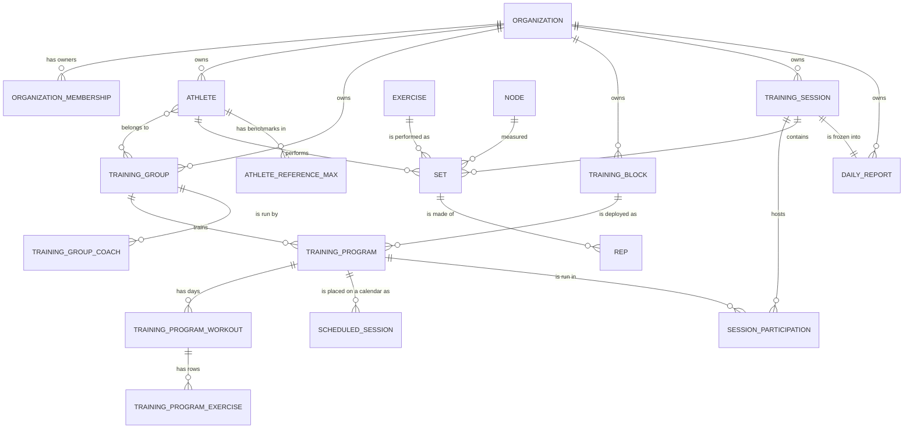

# Edge Athlete — The Database in Plain English

**What this is.** A friendly tour of every table in the Edge Athlete database and how
they fit together — written so you don't need to be an engineer to follow it. If you've
ever wondered "where does the app keep the athletes?" or "what actually happens when a
set finishes?", this is the map.

**The one sentence version.** Edge Athlete watches athletes lift a barbell, measures how
fast the bar moves, and saves every rep so coaches can see who's training well and who's
fatiguing. The database is where all of that is remembered.

> **How to read this doc.** A "table" is just a list — think of a spreadsheet with one
> tab per kind of thing (one tab for athletes, one for sets, and so on). Each row is one
> item; each column is one detail about it. When one table "points to" another, it just
> means a row remembers which row it belongs to — like a set remembering which athlete
> did it. That's all you need to know to follow everything below.

The source of truth is [`django/event_handler/models.py`](../django/event_handler/models.py),
which carries the full reasoning in comments. This is the readable version.

---

## The 30-second big picture

There are five worlds in this system, and the tables split along them:

1. **The account boundary** — the organization and its owner accounts.
2. **The equipment on the gym floor** — the sensors on the bars and the tablets at each rack.
3. **The people** — the athletes, the groups they train in, and the coaches who run them.
4. **The plan** — the reusable templates, the deployed instances, and the calendar.
5. **The training that actually happened** — sessions, sets, reps, and the frozen report.

Training records connect to an **organization** account boundary, an **athlete**
(who), and an **exercise** (what movement). Organization ownership is nullable
during migration and does not yet enforce API authorization.

---

## The idea that explains the whole schema

**A plan never stores pounds. It stores a percent.**

A coach writes "Back Squat — 5×3 at 80%" *once*, for a whole group. Each athlete's actual
bar weight is worked out at the moment it's read: 80% × *that athlete's own current
benchmark*. Thirty athletes, one plan, thirty correct bars — and when someone gets
stronger their weights follow automatically, because the benchmark moved, not because
anyone edited the plan.

This is why you will not find a "target weight" column anywhere. If you go looking for one
and can't find it, that's the design working.

---

## A picture of how it all connects

Plain-English version: **a block** is a template; deploying it makes **a program** for
**a group** of **athletes**; a program has **days**, each with **prescription rows**;
running a day creates **a session**, which holds the **sets** athletes actually did, each
made of **reps**; when the day ends it is frozen into **a daily report**.

---

## World 0 — The account boundary

### `Organization` — one account boundary
An organization groups teams and training records that will share one authorization
boundary. Migration `0023` assigns existing records to a fixed `Legacy Edge Athlete`
organization. New ownership fields remain nullable until every API creation path
derives the organization from an authenticated membership.

### `OrganizationMembership` — an organization owner
This table links an active user to one organization. The foundation supports only
the `owner` role and permits at most one active membership per user. Migration
`0023` grants legacy owner membership to existing active staff accounts; inactive
staff and non-staff accounts remain unmapped.

---

## World 1 — The equipment on the gym floor

### `Node` — the sensor on the barbell
The device (an ESP32 with a motion sensor) clamped to a bar. It's what actually measures
bar speed. Each node has a permanent name (`node_id`), and a coach assigns it to a
physical rack by setting its `rack_number`. It reports its own health every few seconds —
battery, signal, when it was last heard from. It can also carry a list of movements its
rack is *physically capable* of; that filters what the tablet offers, and never blocks a
set.

*Think of it as:* the fitness tracker on the bar.

### `RackScreen` — the tablet standing at a rack
The touchscreen at each rack showing the live workout. Like the node, it has its own
permanent id (`device_id`, created by the browser on first setup) and a `rack_number` a
coach assigns.

> **The single most important "gotcha" in the whole system:** the sensor (`Node`) and the
> tablet (`RackScreen`) are **two completely separate things**. They are *not* linked in
> the database. The only thing that connects them is that a coach put them at the **same
> rack number**. So "Rack 3" is really "whatever sensor a coach called Rack 3" plus
> "whatever tablet a coach called Rack 3" — assigned independently.

### `MonitoringEvent` — "something changed, tell the wall display"
A durable note that the room state moved. It's written the instant something happens, and
a separate loop delivers it to the dashboard afterward and ticks it off. Built this way on
purpose: if the connection drops, the row simply stays undelivered until the next attempt,
instead of the update vanishing.

---

## World 2 — The people

### `Athlete` — a lifter
One person who trains: their name, optional notes, an optional NFC tag id (tap-to-identify
at a rack), and the groups they currently train with.

An athlete can be in **several groups at once** — a football player might also sit in a
speed group, and each group runs its own plan. Which plan applies on a given day is
answered by the session itself. Membership is current-state only: adding or removing a
group never rewrites history, because past sessions and sets stay attached to whatever
they were created under.

### `TrainingGroup` — a named subset of athletes who train together
"Varsity Football", "Freshman Speed".

> ⚠️ **This is not the list of everyone in the system.** Every person lives in `Athlete`;
> a group is a *slice* of them that a coach hangs a plan on. A gym runs many groups at
> once, and several groups can share one session.

It carries no dates and no workouts — it is "who trains together", not a schedule.

### `TrainingGroupCoach` — which staff run a group
Real weight rooms put several people on one group: a head coach plus assistants. This is
the table that says so, with a `role` on each row.

> ⚠️ **Being listed here is a statement, not a permission.** Nothing in the API asks this
> table whether a write is allowed — any logged-in coach can still do anything. That is a
> deliberate choice ("filter, not fence"), so **don't read a row here as authorization**
> until something actually enforces it. See SPEC §9.

### `Tag` — labels for grouping movements
Simple labels hung on exercises — "lower body", "push" — so movements can be filtered.

### `BlockCategory` — labels for finding templates
"Off-season", "Football", "Freshman". Deliberately a *different* table from `Tag`, even
though both are "a name you hang on something": `Tag` is a vocabulary of movement labels,
and mixing the two would make a word like "Upper" mean a body region or a grade level
depending on what it's attached to. A block can have several categories at once, because
a block honestly is both "Off-season" *and* "Football".

### `Exercise` — the official list of movements
The master catalog — "Back Squat", "Bench Press". This exists so a movement means *exactly
one thing* everywhere. Without it, one coach typing "Back Squat" and another typing "back
squat" would quietly split an athlete's history in half. Every plan, benchmark, and set
points at a catalog entry instead of spelling out the name.

*Think of it as:* the gym's official menu — everyone orders from the same menu.

---

## World 3 — The plan

This is the part with the most tables, and it's really one idea repeated twice: **a
timeless template, and a dated copy of it.**

### `TrainingBlock` — the reusable template
A plan a coach designs once and redeploys — tweak last year's block, run it again this
year. It has **no group and no dates**; those only appear when it's deployed. It also
carries how long it runs (`duration_weeks`) and which days of the week it trains
(`cadence_days_of_week`), which is what the calendar generator reads.

- `TrainingBlockWorkout` — one ordered day inside the template ("Day 1: Squat").
- `TrainingBlockExercise` — one prescription row inside a day: which movement, how many
  sets and reps, **what percent**, and the target bar-speed range.

### `TrainingProgram` — the deployed instance
The template, given to a group, placed in time. Deploying **copies** every day and every
prescription row down into the program's own tables.

> **Why copy instead of point?** So the two are independent. Editing a deployed program
> changes only that group's plan; editing the template changes only *future* deployments.
> Neither can reach back and rewrite the other.

A program can also be built from scratch with no template behind it — the link to a block
is optional, and a standalone one-off is a first-class path, not a shortcut. Going the
other way (turning a good one-off *into* a reusable template) copies every day and row
**up** into a new block; just pointing the link would leave a block claiming to be the
source of a program while containing nothing.

- `TrainingProgramWorkout` — the editable copy of a day.
- `TrainingProgramExercise` — the editable copy of a prescription row.

### `AthleteWorkoutExerciseOverride` — the exception for one athlete
The rare case where a percent doesn't fit one specific person. It overrides the **percent**
(or the sets/reps), never a fixed weight — so the athlete's bar still moves with their
benchmark instead of being frozen at a number. Most athletes have none of these; it's a
thin escape hatch, not the common path.

### `ScheduledSession` — one planned slot on the calendar
"This program's Day 3, on Wednesday the 12th." Generated from the block's cadence and
duration.

> ⚠️ **The slot is a plan; the session is the real thing.** A slot starts with no session
> attached and stays that way until a coach actually creates that day. Deleting a session
> leaves its slot behind as an unrun plan, rather than erasing the fact that training was
> scheduled.

Slots are also **frozen once generated** — changing the block's cadence afterwards moves
nothing that already exists. A coach who wants a new cadence deploys again.

---

## World 4 — The training that actually happened

### `TrainingSession` — one training day
A window of time in the gym holding all the sets performed during it.

> ⚠️ **A session can exist before it runs.** Its start time is empty for a session that has
> been created but not started — Thursday's session, set up on Tuesday. It's filled in when
> a coach actually starts the day.
>
> So "the active session" means **started and not ended**, never merely existing. A future
> session that could quietly capture check-ins is exactly the bug this shape prevents.

A session is **shared**: several groups can be on the same one, each through its own
participation row.

### `SessionParticipation` — which group is running which day
The join that lets many groups share one session, each pointing at its own program and the
day it's running. It stores no copy of the plan — what was performed already lives in
`Set`, and what was prescribed gets frozen by the daily report at end of day.

### `Set` — one set an athlete performed
The heart of the system. One athlete, one movement, a number of reps. The row is created
the moment the set *starts*, and its summary — reps completed, average and peak bar speed —
is filled in when it *finishes*. It can be flagged a "false set" if it was aborted.

> **A set is the only permanent record that an athlete actually did something.** Deleting a
> session that contains any lifting is refused outright, rather than silently taking every
> set and rep with it. Ending a day is a timestamp, not a delete.

One flag deserves a warning: `is_coach_adjustment` marks a row a **coach** wrote to change
an athlete's carried-forward working weight, not a real lift. It looks exactly like a
completed set, so every count, status, report, and chart has to consciously exclude it.

### `Rep` — one individual repetition
The finest detail: a single rep with its exact speed, how long it took, and its
green/yellow/red color. This is what the whole sensor system exists to capture.

> ⚠️ **The second big gotcha:** rep rows are **only** created all at once, when a set
> finishes — never one at a time as they happen. While the athlete is lifting, reps are
> held on the tablet, and the whole batch is saved in one go at the end. This keeps the
> workout safe if the gym's WiFi blips mid-set.

### `RackCheckIn` — who's at which rack, right now
A sign-in sheet: every time an athlete checks in at a rack, one row is added. Nobody ever
edits or deletes a row — the **newest** row says which rack they're at, so moving racks
just adds a newer row and they leave the old rack's list. A rack's "hot list" and the
room's live "who's lifting / resting / ready" view are both just *questions asked of this
sheet plus the set times* — nothing extra is stored.

### `AthleteReferenceMax` — an athlete's *current* benchmark strength
The anchor number every percent multiplies against. Two things make it unusual:

- **It is not a lifetime personal best.** It's what the athlete can do *now*, so it can go
  **down** as well as up. If someone comes back weaker, this drops, and their prescribed
  weights drop with it. Lifetime bests are a separate idea, worked out from set history.
- **It only ever adds, never edits.** Each new benchmark writes a brand-new row. The
  athlete's current benchmark is simply their **newest** row for that movement. You get the
  full history of how their strength changed, for free, and nothing is ever lost.

A benchmark can be typed in by a coach or estimated by the system from velocity data — a
`source` field tells them apart. `rep_basis` keeps the honest original fact (a 3-rep effort
is not a 1-rep effort).

*Think of it as:* a dated logbook — you always trust the most recent page, but every old
page is kept.

### `DailyReport` — the frozen record of a finished day
Written once when a session ends, never edited. It holds the **entire day as a snapshot**:
roster, every athlete's sets and reps, racks used, room totals.

> **This is the one deliberate exception to "work it out, don't store it".** A report has to
> keep saying what was true on the day it was made. If it were recalculated on demand, a
> coach editing next week's plan — or an athlete's benchmark drifting — would silently
> rewrite last month's history. Immutability *is* the feature.

**A daily report and a reference max are not the same thing**, and they're easy to confuse:
the report freezes *a day*, the reference max tracks *a person's strength over time*.
Ending a day writes a report **and** may add new reference-max rows — two separate outputs.

---

## How the connections read in plain English

- An **athlete** belongs to many **training groups**; a group has many athletes.
- A **training group** is run by one or more **coaches**, and trains one or more
  **programs** over time.
- A **block** is a template; deploying it **copies** its days and rows into a **program**.
  Neither can edit the other afterwards.
- A **program** has many days (**program workouts**), each with many prescription rows
  (**program exercises**) — and each row stores a **percent**, never pounds.
- A **program** can be laid onto a calendar as many **scheduled sessions**, each of which
  may or may not have become a real session yet.
- A **session** hosts many groups (via **participations**) and contains many **sets**; a
  **set** is made of many **reps**.
- An **exercise** ties the plan, the benchmarks, and the results together, so an athlete's
  plan, strength, and performance for a movement all line up on one identity.
- A **node** measured many **sets** — if a node is removed, its sets survive and simply
  forget which sensor took them.
- A **rack screen** connects to nothing directly; it finds its sensor only by sharing a
  rack number.

---

## Mini-glossary

| Term you'll see | What it means here |
|---|---|
| **Table** | A list of one kind of thing (athletes, sets, …). Like a spreadsheet tab. |
| **Row / record** | One item in that list — one athlete, one set. |
| **Field / column** | One detail about it — a name, a weight, a timestamp. |
| **Points to / belongs to** | A row remembering which other row it's tied to (a set → its athlete). |
| **Many-to-many** | A two-way "many" link (athletes ↔ groups; exercises ↔ tags). |
| **Velocity** | How fast the bar moved, in meters per second — the core measurement. |
| **Velocity zone** | The bar-speed range that counts as "on target" for a prescribed set. |
| **False set** | A botched or aborted set, recorded as such and counted as zero reps. |
| **Reference max** | An athlete's *current* working benchmark for a movement. Not a lifetime best. |
| **Target percent** | The percent of that benchmark a plan prescribes. Pounds are worked out from it. |
| **Block vs. program** | Block = reusable template, no dates. Program = a dated copy given to a group. |
| **Node** | The sensor on the bar. |
| **Rack screen** | The tablet at the rack. (Separate from the node!) |

---

## What used to be here

Two tables you may see referenced in older notes are **gone**, and knowing why saves
confusion:

| Old table | What happened |
|---|---|
| `Program` | The per-athlete plan, one typed weight per person per movement. Replaced by the block/program hierarchy: a plan now belongs to a **group** and stores a **percent**. Dropped in migration `0011`. |
| `Session` | Renamed `TrainingSession` in migration `0012`, so the name says which of the four "session-ish" ideas it is. Full rename list in [`_NAMING_CHANGES.md`](_NAMING_CHANGES.md). |

---

*The tables above describe the current model. If it changes, the source of truth is
[`django/event_handler/models.py`](../django/event_handler/models.py) — keep this overview
in step with it.*
