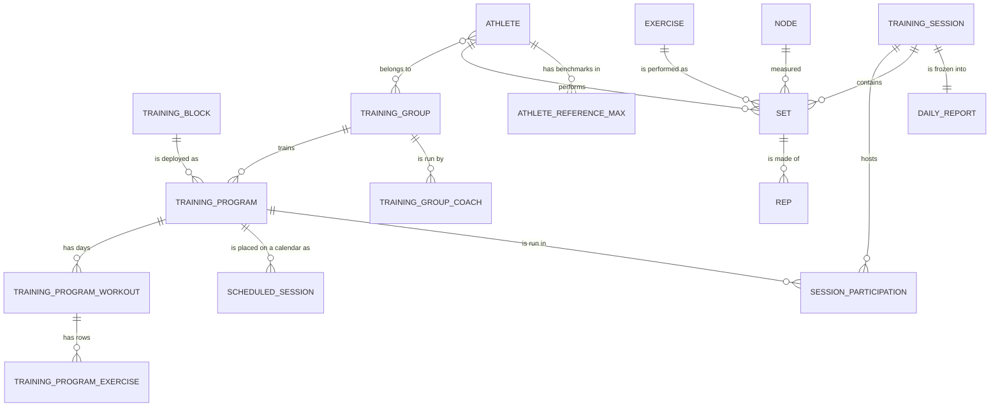

<!--
THE ONE COPY OF THE ENTITY DIAGRAM. Do not paste this anywhere — `{include}` it.

It appears on three pages (reference/database, journal/database, journal/apis) and
three hand-maintained copies would disagree within a month. Deliberately has no
heading, so each page can title it to suit its own table of contents.

Kept out of the build as a page of its own via exclude_patterns in conf.py —
otherwise Sphinx counts it as an orphan and fail_on_warning kills the build.
-->

