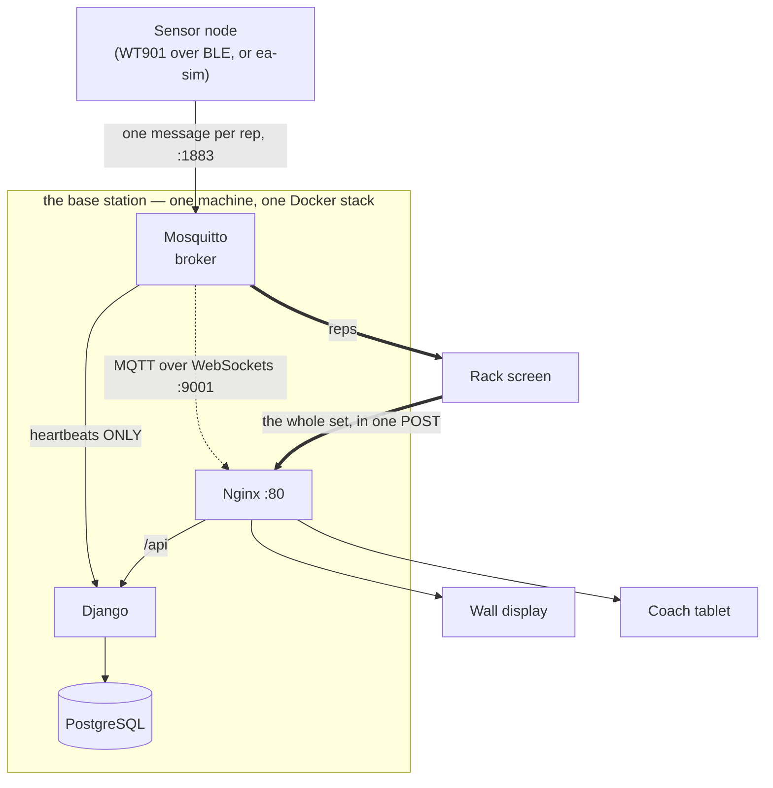

<!--
this guide — the operator's manual for the base station.
Deliberately SHORT at the top: the install is one command, and a page that buries
that under a wall of reference is a page nobody reads to the end. Everything else is
still here, folded into dropdowns, so the page skims in a minute and still answers
the 2am question. If you add to this file, add inside a dropdown.
-->

# Running a base station

:::{note}
Day-to-day operation. For the decisions behind this setup — the install location, the
Wi-Fi agent, why a failed access point does not stop the app — see {doc}`../journal/scripts`.
:::

The whole system runs as one Docker stack on the base station. No cloud, no internet
dependency, no subscription: the box broadcasts its own private Wi-Fi and serves
everything itself.

## Install it

```bash
curl -fsSL https://raw.githubusercontent.com/carbolizer/Edge-Athlete/main/scripts/basestation/bootstrap.sh | sudo bash
```

**Run the same command again to update it.** It is not one-shot.

Three scripts, in order:

| | |
|---|---|
| `scripts/basestation/bootstrap.sh` | installs git, clones to `/srv/edge-athlete/Edge-Athlete`, hands off |
| `scripts/basestation/setup.sh` | Docker, Chromium, the Wi-Fi config, the boot service, the short commands |
| `scripts/basestation/startup.sh` | runs on every boot: access point up, then the stack |

Then change the Wi-Fi password — it ships as a default:

```bash
sudo nano /etc/edgeathlete/basestation.conf
sudo systemctl restart edgeathlete.service
```

Join the **EdgeAthlete** network and open **http://basestation**.

## The short commands

On the box, from any shell. No sourcing, no re-login.

| | |
|---|---|
| `ea-update` | pull latest code and rebuild |
| `ea-seed` | load the demo session, athletes and coach |
| `ea-sim` | start the fake rack sensor |
| `ea-reset` | tear the stack down, update, and bring it back up (database kept) |
| `ea-reset-hard` | same, and wipe the database too (then re-seed) |
| `ea-kiosk-exit` | leave a full-screen screen for the desktop |
| `ea-help` | the full list |

`ea-reset` is the "just make it work again" command: it removes the running
containers (the step `ea-update` deliberately skips — a rebuilt image does not
restart a running container), pulls latest code, and starts fresh containers
from the freshly built images. `ea-reset-hard` adds `-v` to the compose down, so
the postgres volume is deleted too and the demo data is re-seeded — which means
re-assigning any NFC wristbands afterwards (the seeder does not set them).

Rack screens get their own smaller set — `ea-update`, `ea-restart`, `ea-kiosk-log`.
Same names, different device, different behaviour. See {doc}`../journal/scripts`.

## On a monitor

Plug one in and it boots to the wall display, no password. Three launchers are in the
app list — Wall Display, Rack Screen, Coach — all opening full-screen.

Two limits worth knowing before you debug something that is not broken:

- **Full-screen here is not a cage.** Hover the top edge for the toolbar, F11 to
  leave, close to close. Only real rack screens in the gym are locked, and only those
  reopen themselves — that is what `ea-kiosk-exit` is for.
- **These launchers use `localhost`, and gym screens do not.** `localhost` is a
  trusted origin, so the offline cache, app install and Bluetooth all work here and
  are switched off over `http://basestation`. **A bug that reproduces on a rack but
  not on this machine is often that difference, not a coincidence.**

## Setting up a rack screen

A rack screen is a **client**: it joins the base station's Wi-Fi and boots into a
locked full-screen browser. It runs no server and no Docker.

```bash
curl -fsSL https://raw.githubusercontent.com/carbolizer/Edge-Athlete/main/scripts/rack-screen/rack-bootstrap.sh | sudo bash
```

No role argument — a rack screen is a rack screen. A **coach tablet** is the one
exception and is provisioned by hand:
`sudo scripts/rack-screen/rack-kiosk-setup.sh coach`.

:::{dropdown} Bluetooth sensor agent (WT901)

The Agent runs on the central Linux host, outside Docker, so Bleak can use BlueZ.
It owns discovery and connections for every rack. Rack browsers call staff-only
Django endpoints; Django reaches the Agent through `/run/edgeathlete/ble-agent.sock`.
Raw 50 Hz frames and BLE addresses stay in the Agent.

```bash
python3 -m venv .venv-wt901
.venv-wt901/bin/pip install -r scripts/hardware/requirements.txt
AGENT_USER="${SUDO_USER:-$USER}"
AGENT_GROUP="$(id -gn "$AGENT_USER")"
sudo install -d -o "$AGENT_USER" -g "$AGENT_GROUP" -m 0700 /etc/edgeathlete/ble-agent
sudo install -d -o "$AGENT_USER" -g "$AGENT_GROUP" -m 0750 /run/edgeathlete
sudo -u "$AGENT_USER" .venv-wt901/bin/python scripts/hardware/wt901_rack_agent.py \
  --socket-path /run/edgeathlete/ble-agent.sock \
  --state-path /etc/edgeathlete/ble-agent/bindings.json \
  --mqtt-host 127.0.0.1 \
  --mqtt-port 1883
```

Add `--enable-provisional-reps` only for private-AP demo or detector
qualification. It publishes bounded WT901 accepted-rep estimates on the existing
`edgeathlete/node/{node_id}/rep` topic. Leave it off for normal use until MQTT
publisher ACLs or accepted-event replay fencing are implemented.

Legacy single-device diagnostics remain available for hardware troubleshooting:

```bash
.venv-wt901/bin/python scripts/hardware/wt901_rack_agent.py \
  --address '<physically enrolled address>' \
  --node-id wt901_test_1 \
  --allowed-origins 'http://basestation,http://192.168.4.1,http://127.0.0.1:8081'
curl -fsS http://127.0.0.1:8765/health
```

The Agent creates `bindings.json` atomically with mode `0600`; do not pre-create
an empty file. The invoking operator account owns the socket and private state and
must already be allowed to scan/connect through BlueZ; confirm with
`bluetoothctl scan on` before launch. The Django container currently runs as root and receives `/run/edgeathlete` through
`docker-compose.basestation.yml`; no browser or Nginx route exposes the socket.
The central selection flow never sends an address to Django or a browser. Keep
each sensor still while its committed connection calibrates. Rack
check-in remains disabled until server health reports its selected logical node
as `live` with a sample under one second old.

Failure behavior:

- A disconnect or two seconds without notifications forces BLE reconnect and recalibration.
- Rack health polling reads fresh samples through the trusted Unix socket. Django
  rejects MQTT pulses for WT901 nodes, so payload metadata cannot restore freshness.
- MQTT outages do not affect central BLE health. The Agent reconnects each sensor independently.
  Opt-in accepted WT901 reps publish only while the broker is reachable;
  Agent-side replay is not implemented.
- `403 origin_not_allowed` means the browser origin must be added explicitly to
  `--allowed-origins`; do not solve it by binding the Agent off-loopback.

Current limitation: launch is manual. Before unattended deployment, add a
supervised system service. WT901 rep detection is provisional until it passes the
100-rep and 10-minute noise qualification protocol. Accepted-event queuing is a
separate later slice.

The current detector uses the 50 Hz acceleration, gyro, and orientation frame.
The configured `0x61` WT901 payload has no altitude channel. A rep must complete a
translation away from and back near its calibrated starting position. A completed
return does not require a long pause between consecutive reps; stillness after an
incomplete return rejects the movement. Pickup, wiggle, and rotation-only motion
must not be used as rep demos.
:::

:::{dropdown} NFC reader

The first NFC slice supports one USB CCID contactless reader (`2ce3:9567`) on
Rack 1. The host Agent uses direct USB through PyUSB because rack browsers cannot
access CCID devices. It sends one-time taps to Django through a mode-`0600` Unix
socket; tag IDs do not cross HTTP, MQTT, URLs, or normal logs.

```bash
python3 -m venv .venv-nfc
.venv-nfc/bin/pip install -r scripts/hardware/requirements.txt
.venv-nfc/bin/python scripts/hardware/ccid_rack_agent.py \
  --socket-path /run/edgeathlete/nfc-agent.sock \
  --rack-number 1
```

The invoking account must have USB access, normally through `plugdev`. Tap a tag
on the contactless face. The Agent waits for CCID slot-change notifications and
limits event processing to five cycles per second. A held tag creates one event;
remove it before tapping again. After USB recovery, remove and retap the tag to
generate a fresh notification. Unknown and off-roster tags both display
`Wristband not recognized`. USB errors close and reopen the reader every two
seconds until it recovers. BLE acquisition and active-set completion do not depend
on NFC.

Store tag mappings through a protected operator workflow or import. Use canonical
uppercase hex without separators, never place a real tag ID in this repository or
terminal logs. NFC Agent startup is manual until a supervised host service is added.
:::

:::{dropdown} Firmware flashing

**There is no firmware in this repository, and no `firmware/` directory.** The ESP32
work was planned as Phases 13 and 17 and never landed here, so there is nothing to
flash and no steps to follow. See {doc}`../history` for where that sits.

This is worth stating plainly rather than leaving as a promise, because every sensor
you can currently drive is either a **WT901 over Bluetooth** (the dropdown above) or
the **software simulator** (`ea-sim`). Both work without flashing anything.
:::

## Reference

Everything below is folded away on purpose. Open what you need.

:::{dropdown} The services, and what each one does

Every service is defined in `docker-compose.yml` and shares one private Docker
network, so services reach each other by name (e.g. `postgres`, `mosquitto`).

| Service | Port(s) | Purpose |
|---|---|---|
| `postgres` | 5432 (internal) | PostgreSQL database — the single source of durable data. Only set-level data is ever written here. |
| `mosquitto` | 1883 (MQTT), 9001 (MQTT-over-WebSockets) | The message broker. Nodes + Django use 1883; browsers connect directly to 9001. |
| `django` | 8000 (internal) | The web/REST server (sync `runserver`). Handles all `/api/` and `/admin/` requests. |
| `mqtt-listener` | — | The ONE MQTT subscriber process. Listens to node pulse topics and updates node health. |
| `react` | 80 (internal) | Builds the front-end to static files and serves them via its own Nginx. |
| `nginx` | 80 (published) | The front door. Routes `/api/`, `/admin/`, `/static/*` to Django and everything else to React. |
| `seed` | — | **On demand only.** Fills an empty database with a demo gym. Profile-gated, so `docker compose up` never starts it. See **Seeding demo data** (in Reference, below). |
| `simulator` | — | **On demand only.** A fake rack sensor for demos without hardware. Also profile-gated. See **Running a demo without hardware** (in Reference, below). |

> There is exactly ONE MQTT listener service (`mqtt-listener`). The reference
> project ran a second, duplicate listener — it has been removed here.
:::

:::{dropdown} Running the tests — read this before trusting a green run
**The Django image contains a *copy* of the source. There is no live mount.** So this
tests whatever you last built, not what is on disk:

```bash
docker compose run --rm django python manage.py test event_handler
```

Edit a file, run that, and you can get a confident pass that never saw your change.
It has already happened once during this project: a whole suite reported OK while the
edit under test was not in the image.

Build first, every time:

```bash
docker compose build django
docker compose run --rm django python manage.py test event_handler
```

The frontend has no such trap — Vite reads the working tree directly:

```bash
cd react && npx vitest run
```

**This does not affect the base station.** `ea-update` runs `setup.sh`, which builds
the images as part of provisioning, so a deployed box is always on current code. The
trap is local development only.

Why it is worth a note rather than a fix: the failure mode is a **passing** test run.
Nothing errors, nothing looks wrong, and the result is wrong in the direction you were
hoping for — which is the hardest kind to catch by noticing.
:::

:::{dropdown} Start, stop, and watch logs

From the repo root (where `docker-compose.yml` lives):

```bash
# Start the whole stack (build images the first time or after changes)
docker compose up --build          # add -d to run detached in the background

# Stop it (containers stop, data volumes persist)
docker compose down

# Stop AND wipe the database volume (destructive — fresh start)
docker compose down -v

# Watch logs for one service
docker compose logs -f django
docker compose logs -f mqtt-listener
```

First boot builds the Django and React images and runs database migrations
automatically (via the Dockerfile / listener command). The app is reachable at
`http://<pi-ip>/` (or `http://localhost/` on the dev host).
:::

:::{dropdown} Demo data: what seeding creates

A freshly migrated database is empty — no athletes, no session, and no coach
login, so `/coach` cannot even be signed into. One command fills it:

```bash
docker compose run --rm seed
```

That gives you a live training day ("Thursday — Lower + Push"), four athletes,
the plan they train, recorded reference maxes, two already-finished sets, and the
demo coach login (`coach` / `coachpass`).

**`seed` is a one-shot, and it is invisible to `docker compose up`.** It carries a
Compose *profile*, which means the service does not exist unless you name it —
demo data can never appear on its own at boot.

Running it again is safe. The seeder converges instead of piling up: it closes
whatever day was left open, reuses the group's existing plan rather than
deploying a second one, and matches its own rows by name. Two runs leave exactly
**one** open session, which is the rule the whole app depends on (canon D18).

> ⚠️ **`--reset` is not passed, on purpose.** The seeder's reset flag deletes the
> rows it thinks are its own, but it matches them **by name** — on a real base
> station that would take out a group genuinely called "Varsity", plus any athlete
> sharing a name with the demo four, and their sets with them. On a laptop, where
> that is fine, ask for it explicitly:
>
> ```bash
> docker compose run --rm seed python manage.py seed_active_session --reset
> ```
:::

:::{dropdown} Running a demo with no hardware

The `simulator` service is a fake rack sensor. It publishes the same pulse and
rep messages a real node would, on the same topics, so the tablet and the wall
display can be demoed with nothing bolted to a rack.

```bash
docker compose --profile demo up -d simulator     # runs until you stop it
docker compose logs -f simulator                  # watch it decide
docker compose --profile demo down simulator      # stop it
```

**It stays quiet until the rack is actually being used.** By default the rep
stream is gated on a set being open at the linked rack, so a demo reads like
this:

| What the room is doing | What the node publishes |
|---|---|
| No training day running | pulses only |
| Day running, nobody at the rack | pulses only |
| Athlete checked in, between sets | pulses only |
| **Set open at that rack** | **pulses + reps** |
| Set ended | pulses only |

The heartbeat never stops, on purpose — pulses are how Django knows the node is
alive, so going quiet on those would make an idle rack look like a dead one.

The rack it watches comes from the **node's own database row**, re-read every
couple of seconds. Link the sensor to a rack mid-demo and it wakes up on its
own; there is nothing to restart.

Loosen the gate with `--active-when` if you want a chattier demo:

| Mode | Publishes reps when |
|---|---|
| `lifting` *(default)* | a set is open at the rack |
| `checkin` | anyone is checked in there, set or no set |
| `always` | never pauses — the behaviour from before the gate existed |

Simulating a second rack needs no compose edit:

```bash
docker compose run --rm simulator python manage.py simulate_node --node-id rack_2
```

> The gate reads the database directly rather than calling
> `GET /api/sessions/active/status/`. It is a management command, so it is
> already inside the ORM — the HTTP route would be the same rows with a web
> server and a base URL in the way. It reuses `active_session()` for "which day
> is live", so it can never disagree with the screens about that (canon D18).
:::

:::{dropdown} Database migrations and rollback

Migrations apply automatically on Django boot. To roll one back, migrate the app
to the migration you want to land on — Django reverses everything after it:

```bash
# Roll back to a specific migration (undoes every later one for this app).
# Example: undo the AthleteReferenceMax table (0003) and land on 0002.
docker exec edgeathlete-django python manage.py migrate event_handler 0002_set_weight_lbs

# See what's applied / what a rollback would undo
docker exec edgeathlete-django python manage.py showmigrations event_handler
```

There are no separate "down" files — each migration reverses itself. Schema
migrations (add/drop a table or column) roll back cleanly. The one thing to
watch: a **data** migration (one that moves or backfills rows, `RunPython`) only
reverses if someone wrote its reverse step — otherwise it's one-way.

**There are six data migrations.** Four restore or safely discard generated data;
`0018` and `0019` deliberately cannot reconstruct cleared legacy mappings:

| | What it moves | Reverse |
|---|---|---|
| `0005` | Text exercise names → catalog links | Writes the names back |
| `0009` | Seeds the starter movement catalog | Deletes exactly the rows it added |
| `0013` | Backfills "last edited" from "created" | `noop` — rolling back drops the column anyway |
| `0015` | Each group's single coach → the staff table | Puts the head coach back |
| `0018` | Clears duplicate rack-node mappings before adding uniqueness | Leaves current explicit mappings intact; cleared legacy mappings must be restored from a pre-migration database backup and reselected at each rack |
| `0019` | Clears MQTT-unsafe assigned node IDs before adding its constraint | Leaves current explicit mappings intact; cleared legacy mappings must be restored from backup and reselected after correcting the node ID |

Anything you add from here needs the same treatment — see
{doc}`migrations`, which is the full
guide to changing this schema safely.
:::

:::{dropdown} Config files, and where they live

| File | What it controls |
|---|---|
| `.env` | Real runtime values (DB login, MQTT host, Django secret). **Gitignored.** |
| `.env.example` | Committed template of `.env` with blank values. |
| `docker-compose.yml` | Which services run and how they're wired together. |
| `mosquitto/mosquitto.conf` | The broker's two listeners: 1883 (MQTT) + 9001 (WebSockets). |
| `nginx/nginx.conf` | Reverse-proxy routing: `/api/`, `/admin/`, `/static/*` → Django, `/` → React. |
| `django/basestation_config/settings.py` | Django configuration (reads everything from `.env`). |
:::

:::{dropdown} MQTT test commands

The broker allows anonymous connections through Sprint 3, so these work with no auth.

```bash
# Watch every Edge Athlete topic (run in its own terminal)
mosquitto_sub -h localhost -t 'edgeathlete/#' -v

# Publish a fake pulse and confirm the subscriber above sees it
mosquitto_pub -h localhost -t edgeathlete/node/test/pulse -m '{}'
```

Browser check (proves the 9001 WebSockets door works — this is the path all
three screen types use). In a browser JS console with an `mqtt.js` client:

```js
const c = mqtt.connect(`ws://${location.hostname}:9001`);
c.on('connect', () => c.subscribe('edgeathlete/node/test/pulse'));
c.on('message', (t, m) => console.log(t, m.toString()));
// then, from a terminal:
//   mosquitto_pub -t edgeathlete/node/test/pulse -m '{}'
// the console should log the message.
```
:::

:::{dropdown} When something is wrong

Every one of these has actually happened. They are ordered by how often.

**`ea-update: command not found`**
The commands are symlinks in `/usr/local/bin` pointing at `scripts/basestation/ea.sh`.
If they are missing, the last `setup.sh` did not finish. Re-run the install command —
it is not one-shot — or call the script directly:
`sudo /srv/edge-athlete/Edge-Athlete/scripts/basestation/ea.sh update`.

They used to be shell *functions* dropped in `/etc/profile.d`, which only login shells
read. That is why this used to come back after every reboot. If it still does, you are
running an old install.

**HTTP 502 on some pages, usually the coach ones**
Nginx is up and Django is not. Almost always a container that failed to restart after
an update:

```bash
cd /srv/edge-athlete/Edge-Athlete
sudo docker compose ps          # anything not "running"?
sudo docker compose logs django --tail 50
```

**The demo runs, but no reps arrive**
A node that has not registered is rejected, and the rejection is quiet. `ea-sim`
registers its node on startup; anything older did not. Check the simulator is actually
saying something:

```bash
ea-sim-log
```

Then confirm the node shows up unassigned on the coach admin page and link it to a
rack. A sensor publishing into a rack it was never linked to looks perfectly healthy
in its own log.

**A rebuild "succeeded" but behaviour did not change**
Two separate traps, both silent:

- The Django image **bakes the source in**. There is no volume mount, so editing a
  file changes nothing until `sudo docker compose build django`.
- `docker compose build` **skips profile-gated services**. The seeder and the
  simulator sit behind `--profile seed` and `--profile demo`, so a plain build leaves
  them on whatever code they were last built with — which can be months old. `ea-seed`
  and `ea-sim` now build their own image first; a hand-run `docker compose` will not.

**The box takes about two minutes to boot**
It is waiting on a network service that manages nothing here. `setup.sh` masks
`systemd-networkd-wait-online` for this reason. If a machine still stalls:

```bash
systemd-analyze blame | head
```

**No EdgeAthlete Wi-Fi network**
The adapter cannot do AP mode, which cannot be scripted around. The app still comes up
over a cable — the startup log says so plainly rather than failing silently:

```bash
sudo journalctl -u edgeathlete.service -e
```

**Works on the base station's own screen, broken on a rack**
Check the address bar before anything else. The local launchers use `localhost`, which
browsers treat as a trusted origin; rack screens use `http://basestation`, which they
do not. The offline cache, app install and Bluetooth are all switched off on the second
one. This difference is a real cause of "it only breaks in the gym", not a coincidence
— {doc}`../journal/rack-tablet` has the full reasoning.

**The wall display sits on stale numbers**
It refetches when the server announces a change, and backs that up with a poll every
twenty seconds. If it is stuck for longer than that, the browser lost the broker
rather than the data being wrong. Reload it.
:::

:::{dropdown} Install reference: paths, service, first-boot flags

One command on a fresh machine. It installs Docker, pulls the code, writes the
boot service, and builds the stack:

```bash
curl -fsSL https://raw.githubusercontent.com/carbolizer/Edge-Athlete/main/scripts/basestation/bootstrap.sh | sudo bash
```

Run the **same command again** to update a base station later — it is not
one-shot.

| | Path |
|---|---|
| The install | `/srv/edge-athlete/Edge-Athlete` |
| This machine's Wi-Fi settings | `/etc/edgeathlete/basestation.conf` (**not** in git) |
| Boot service | `edgeathlete.service` |

Then, before the gym uses it:

```bash
sudo nano /etc/edgeathlete/basestation.conf   # AP_PASSWORD is still the default
sudo systemctl restart edgeathlete.service
```

Nothing depends on which user is logged in, and the scripts work from wherever
the repo was cloned. Full detail — including what to do when the access point
won't start — is in {doc}`../journal/scripts`.

A coach can also change the Wi-Fi password from the coach admin page. It applies
live via a host agent, and **disconnects every device** — tablets, wall display,
and each rack Pi — which must then rejoin by hand. It's a walk-around; do it
between sessions. See "Changing the Wi-Fi password" in
{doc}`../journal/scripts`.
:::

:::{dropdown} The long-form first install, step by step

Clean Linux machine to a running base station. Run the same command again later to
**update** a box — it is not one-shot.

### Before you start

- **Debian or Ubuntu** on the mini PC (x86).
- A **Wi-Fi adapter that supports AP mode** — the base station broadcasts its own
  network, so setup refuses without one. Check: `iw list | grep -A5 "Supported interface modes"` (look for `AP`).
- **Internet for the install only** (to pull Docker + build images). It runs fully offline after that.
- **sudo/root** access.

### 1. Install — one command

```bash
curl -fsSL https://raw.githubusercontent.com/carbolizer/Edge-Athlete/main/scripts/basestation/bootstrap.sh | sudo bash
```

Installs git + Docker + NetworkManager, clones the repo to
`/srv/edge-athlete/Edge-Athlete`, generates a unique `SECRET_KEY`, detects the
Wi-Fi adapter, installs the boot service, and builds the stack. Slow the first
time — it's building images.

### 2. Set the Wi-Fi password

Ships as `ChangeMe123!` — change it before anything real:

```bash
sudo nano /etc/edgeathlete/basestation.conf
```

Edit the `AP_PASSWORD` line, save, exit. (Can also be done later from the coach page.)

### 3. Start it

```bash
sudo systemctl start edgeathlete.service
```

Brings up the "EdgeAthlete" Wi-Fi and all the containers. Comes up on its own after every reboot from here on.

### 4. Connect and open

Join the **EdgeAthlete** Wi-Fi (password from step 2), then open:

```
http://basestation
```

Coach login: **`coach` / `coachpass`**.

### 5. Fill it with demo data (optional)

Empty database otherwise. From the repo folder:

```bash
cd /srv/edge-athlete/Edge-Athlete && docker compose run --rm seed
```

A live session, the team, plans, and some finished sets.

### 6. Fake a rack sensor for a demo (optional)

No hardware needed — publishes reps only while a set is open at rack 1:

```bash
cd /srv/edge-athlete/Edge-Athlete && docker compose --profile demo up -d simulator
```

### Quick checks if something's off

All seven containers up:

```bash
cd /srv/edge-athlete/Edge-Athlete && docker compose ps
```

App healthy:

```bash
curl -s http://localhost/api/health/
```

Boot script output (AP + stack startup):

```bash
sudo journalctl -u edgeathlete.service -e
```

> **The one thing that can't be scripted around:** steps 1 and 3 need that Wi-Fi
> adapter to do AP mode. If it can't, the app still comes up (reachable over a
> cable), but there's no gym Wi-Fi — the startup log says so plainly. Everything
> else is hands-off.
:::

:::{dropdown} Architecture diagram

Everything in the dashed box is one Docker stack on the one machine.



Two things in that picture do most of the explaining:

**Reps never reach the server one at a time.** Follow the thick line: a rep goes from
the node to the broker to the rack screen and stops there. The screen writes it to
browser storage as it arrives, and only when the set ends does it POST the whole set
in a single request. The database gets **one write per set**, not one per rep — and a
Wi-Fi drop mid-set loses nothing.

**Django is not in the live path.** The only node traffic it listens to is heartbeats.
The screens talk to the broker directly, and there is no WebSocket layer in Django;
adding one was considered and rejected. {doc}`../journal/real-time` covers why.
:::
